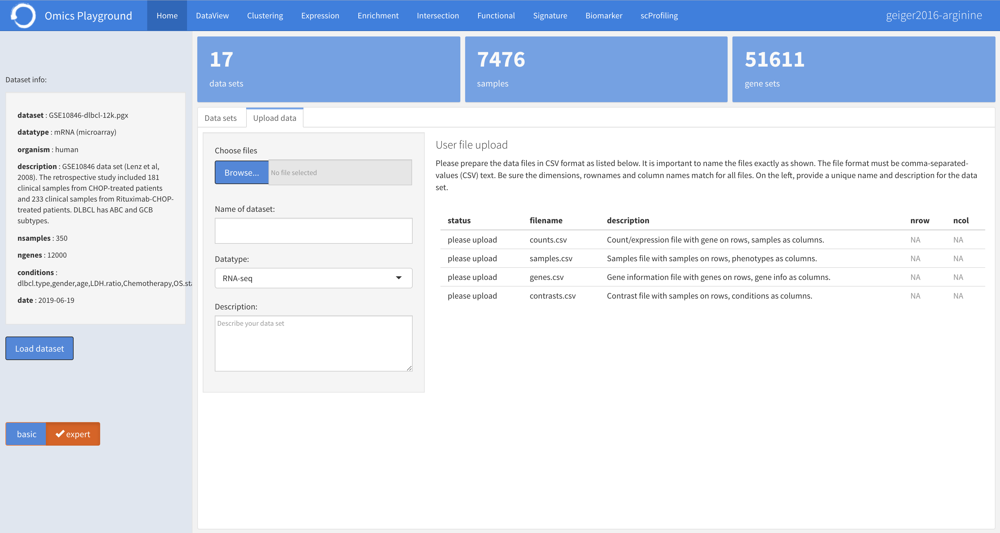

.. _Dataprep_example:

Data preparation examples
================================================================================
The platform requires the transcriptomics and proteomics data to be in a 
structured format as an input. Users can inject their data to the platform by
either `uploading through the interface`_ or 
`preparing an input object using scripts`_.

Uploading data through the interface
--------------------------------------------------------------------------------

.. _`uploading through the interface`:

Users can import their data from the **Upload data** panel located under the 
:ref:`Home` module. The platform requires the list of files as shown in the
figure below. 
The format of files must be comma-separated-values (CSV) text.
It is important to name the files exactly as shown.
Be sure the dimensions, rownames and column names match for all files. 
It is required to provide a unique name and brief description for the data set
while uploading.

:**counts.csv**: 	  Count/expression file with gene on rows, samples as columns.
:**samples.csv**: 	Samples file with samples on rows, phenotypes as columns.
:**genes.csv**: 	  Gene information file with genes on rows, gene info as columns.
:**contrasts.csv**: Contrast file with samples on rows, conditions as columns.

Preparing an input object using scripts
--------------------------------------------------------------------------------

.. _`preparing an input object using scripts`:

Alternatively, an input object can be prepared by using scripts with more 
detailed data cleaning, filtering, normalisation and preprocessing. 
Users can prepare an input data from
their own FASTQ files, gene counts tables, or from a dataset of interest stored 
in public repositories such as `GEO <https://www.ncbi.nlm.nih.gov/geo/>`__.
Similarly, they can also prepare an input from single-cell or LC-MS/MS proteomics
datasets.
We provide four types of example cases to guide users for preparing their input 
objects and injecting it into the platform. Basically, the example cases 
illustrate how to prepare an input data:

1. `from FASTQ files`_, 
2. `from gene counts table or from the GEO repository`_,
3. `from single-cell data`_,
4. `from LC-MS/MS proteomics data`_.

All the necessary scripts for data cleaning and preprocessing examples can be
found under the ``scripts/`` folder.

From FASTQ files
~~~~~~~~~~~~~~~~~~~~~~~~~~~~~~~~~~~~~~~~~~~~~~~~~~~~~~~~~~~~~~~~~~~~~~~~~~~~~~~~

.. _`from FASTQ files`:

Starting from FASTQ files, we recommend using the `GREP2
<https://www.rdocumentation.org/packages/GREP2/versions/1.0.2>`_
package to obtain gene counts through quality control, trimming,
quantification of gene abundance, and so on.  Afterwards, the user can
refer to the examples in the next section for preparing an input data
from the gene counts.

From gene counts table or GEO repository
~~~~~~~~~~~~~~~~~~~~~~~~~~~~~~~~~~~~~~~~~~~~~~~~~~~~~~~~~~~~~~~~~~~~~~~~~~~~~~~~

.. _`from gene counts table or from the GEO repository`:

Users can prepare an input data from their own gene counts or download a
relevant dataset from repositories such as `GEO <https://www.ncbi.nlm.nih.gov/geo/>`__.
Some examples are provided in the following scripts:

* `TCGA-BRCA <https://portal.gdc.cancer.gov/projects/TCGA-BRCA>`__: ``pgx-tcga-brca.R``
* `TCGA-PRAD <https://www.cbioportal.org/study/summary?id=prad_tcga>`__: ``pgx-tcga-prad.R``
* `GSE10846 <https://www.ncbi.nlm.nih.gov/geo/query/acc.cgi?acc=GSE10846>`__: ``pgx-GSE10846-dlbcl.R``
* `GSE114716 <https://www.ncbi.nlm.nih.gov/geo/query/acc.cgi?acc=GSE114716>`__: ``pgx-GSE114716-ipilimumab.R``
* `GSE22886 <https://www.ncbi.nlm.nih.gov/geo/query/acc.cgi?acc=GSE22886>`__: ``pgx-GSE22886-immune.R``
* `GSE28492 <https://www.ncbi.nlm.nih.gov/geo/query/acc.cgi?acc=GSE28492>`__: ``pgx-GSE28492-roche.R``
* `GSE32591 <https://www.ncbi.nlm.nih.gov/geo/query/acc.cgi?acc=GSE32591>`__: ``pgx-GSE32591-lupusnephritis.R``
* `GSE53784 <https://www.ncbi.nlm.nih.gov/geo/query/acc.cgi?acc=GSE53784>`__: ``pgx-GSE53784-wnvjev.R``
* `GSE88808 <https://www.ncbi.nlm.nih.gov/geo/query/acc.cgi?acc=GSE88808>`__: ``pgx-GSE88808-prostate.R``

From single-cell data
~~~~~~~~~~~~~~~~~~~~~~~~~~~~~~~~~~~~~~~~~~~~~~~~~~~~~~~~~~~~~~~~~~~~~~~~~~~~~~~~

.. _`from single-cell data`:

Single-cell RNA sequencing experiments have been valuable to provide insights into 
complex biological systems, reveal complex and rare cell populations, uncover 
relationships between genes, and track the trajectories of cell lineages.
Below we provide some data preparation examples from single-cell experiments:

* `GSE72056 <https://www.ncbi.nlm.nih.gov/geo/query/acc.cgi?acc=GSE72056>`__: ``pgx-GSE72056-scmelanoma.R``
* `GSE92332 <https://www.ncbi.nlm.nih.gov/geo/query/acc.cgi?acc=GSE92332>`__: ``pgx-GSE92332-scintestine.R``
* `GSE98638 <https://www.ncbi.nlm.nih.gov/geo/query/acc.cgi?acc=GSE98638>`__: ``pgx-GSE98638-scliver.R``

From LC-MS/MS proteomics data
~~~~~~~~~~~~~~~~~~~~~~~~~~~~~~~~~~~~~~~~~~~~~~~~~~~~~~~~~~~~~~~~~~~~~~~~~~~~~~~~

.. _`from LC-MS/MS proteomics data`:

Two examples are provided below for LC-MS/MS proteomics data preprocessing:

* `Geiger et al. 2016 <https://www.ncbi.nlm.nih.gov/pubmed/27745970>`__: ``pgx-geiger2016-arginine.R``
* `Rieckmann et al. 2017 <https://www.ncbi.nlm.nih.gov/pubmed/28263321>`__: ``pgx-rieckmann2017-immprot.R``

