.. _examples:

Reanalyzing Public Datasets
================================================================================
To illustrate the use case of the Omics Playground, we reanalyzed different types
of publics datasets, including microarray, bulk RNA-seq, single-cell RNA-seq and
proteomic datasets to recapitulate the results.

Single-cell RNA-seq data
--------------------------------------------------------------------------------
For single-cell RNA-seq data, we downloaded the melanoma data set 
`GSE72056 <https://www.ncbi.nlm.nih.gov/geo/query/acc.cgi?acc=GSE72056>`__ of
`Tirosh et al. <https://www.ncbi.nlm.nih.gov/pubmed/27124452>`__.
Our platform recapitulates well the original findings of the paper. 
The t-SNE clustering (`Figure 1`_) separates the different cell types. 
`Figure 2`_ and `Figure 3`_ show the volcano plot, MA plot and most differentially
expressed genes between malignant and non-malignant cells. 
The CNV map (`Figure 4`_) confirms the major chromosomal copy number 
variations found in the malignant cells. `Figure 5`_ shows high enrichment
of a immune checkpoint signature, particularly concentrated in the T cells.
The biomarker heatmap (`Figure 6`_) highlights the marker genes for
each cell type. Each gene cluster is furthermore automatically
annotated with the most correlated gene sets (`Figure 7`_).

tSNE plot
~~~~~~~~~~~~~~~~~~~~~~~~~~~~~~~~~~~~~~~~~~~~~~~~~~~~~~~~~~~~~~~~~~~~~~~~~~~~~~~~

.. _`Figure 1`:

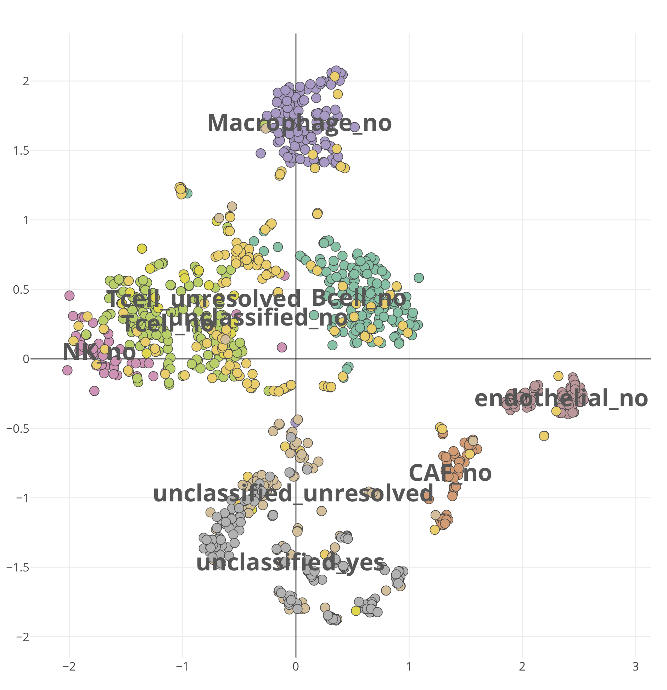

**Figure 1**. The t-SNE clustering with cell type annotation for the 
:option:`GSE72056-scmelanoma` dataset. 
To reproduce the figure on the platform, select and load 
:option:`GSE72056-scmelanoma` dataset, 
and go to the **PCA/tSNE** panel of the **Clustering** module. 
From the plot *Settings*, 
set the :option:`color: group`, :option:`layout: tsne`, and leave other settings
as default.

Volcano and MA plot
~~~~~~~~~~~~~~~~~~~~~~~~~~~~~~~~~~~~~~~~~~~~~~~~~~~~~~~~~~~~~~~~~~~~~~~~~~~~~~~~

.. _`Figure 2`:

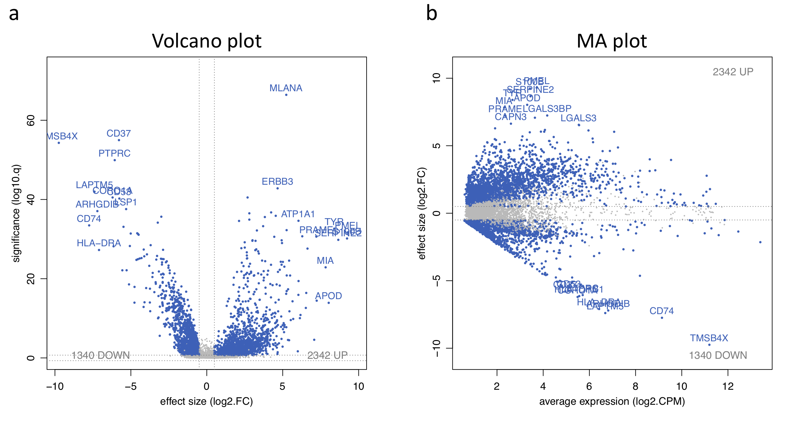

**Figure 2**. Volcano and MA plot for the malignant versus non-malignant contrast.
To replicate the figure on the platform, go to the **Plots** panel of 
the **Expression** module. From the input slider, 
set the :option:`Contrast: yes_vs_no` and :option:`Gene family: all`.

Differentially expressed genes
~~~~~~~~~~~~~~~~~~~~~~~~~~~~~~~~~~~~~~~~~~~~~~~~~~~~~~~~~~~~~~~~~~~~~~~~~~~~~~~~

.. _`Figure 3`:

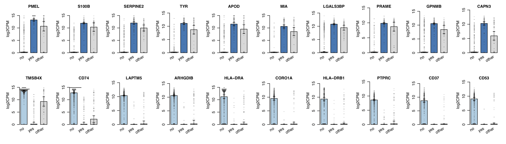

**Figure 3**. Barplot of corresponding differentially expressed genes.
To obtain the figure on the platform, 
go to the **Top genes** panel of the **Expression** module. From the input slider, 
set the :option:`Contrast: yes_vs_no` and :option:`Gene family: all`.
    

Inferred copy number
~~~~~~~~~~~~~~~~~~~~~~~~~~~~~~~~~~~~~~~~~~~~~~~~~~~~~~~~~~~~~~~~~~~~~~~~~~~~~~~~

.. _`Figure 4`:

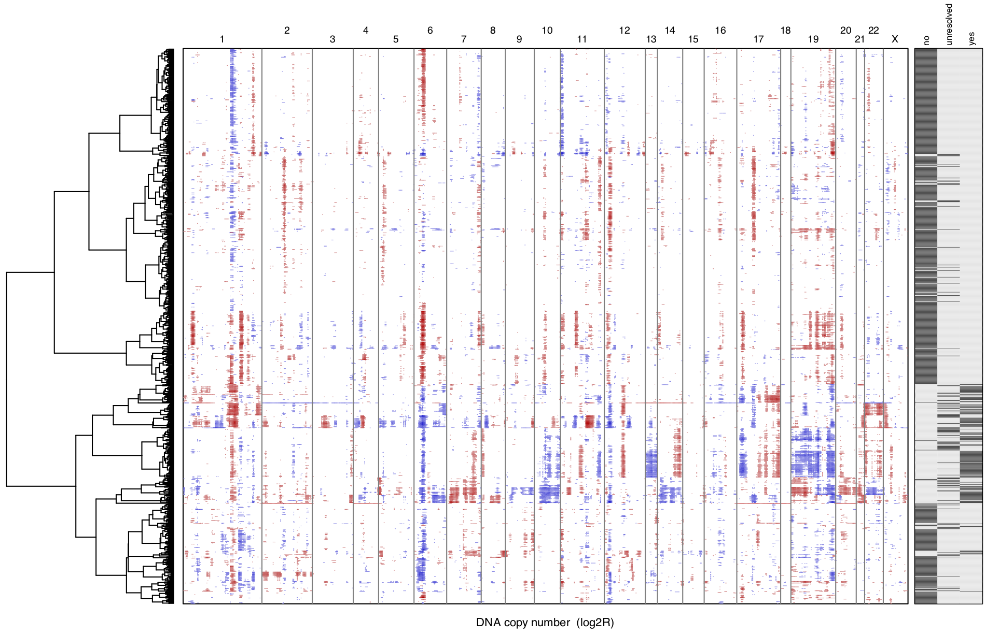

**Figure 4**. Inferred copy number for sample Cy80.
To reproduce the figure on the platform, go to the **CNV** panel of the
**scProfiling** module. From the plot *Settings*, 
set the :option:`Annotate with: malignant` and :option:`Order samples by: clust`.
    
    
Immune checkpoint signature
~~~~~~~~~~~~~~~~~~~~~~~~~~~~~~~~~~~~~~~~~~~~~~~~~~~~~~~~~~~~~~~~~~~~~~~~~~~~~~~~

.. _`Figure 5`:

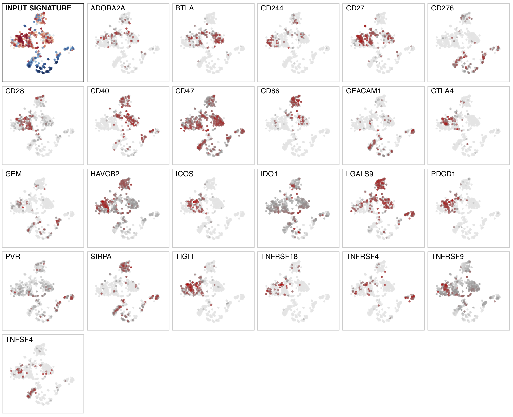

**Figure 5**. Enrichment distribution for an immune checkpoint signature showing high
enrichment in T and B cells .
To regenerate the figure on the platform, go to the **Marker** panel in 
the **Signature** module. From the input slider, 
select :option:`Contrast: custom` and :option:`Signature: immune_chkpt` as it is
provided in the sample list.
    

Biomarker heatmap
~~~~~~~~~~~~~~~~~~~~~~~~~~~~~~~~~~~~~~~~~~~~~~~~~~~~~~~~~~~~~~~~~~~~~~~~~~~~~~~~

.. _`Figure 6`:

.. figure:: figures/fig2_f.png
    :align: center
    :width: 100% 

**Figure 6**. Biomarker heatmap for non-malignant cells.
To reproduce the figure on the platform, go to the **Heatmap** panel in the 
**Clustering** module. From the input slider, 
set the :option:`Filter samples: cell.type={Bcell,
CAF, endothelial, Macrophage, NK, Tcell}`.
In the plot *Settings*, set :option:`Plot type: ComplexHeatmap`, :option:`split by: 
cell.type`, and :option:`top mode: specific`.

Annotate heatmap clusters
~~~~~~~~~~~~~~~~~~~~~~~~~~~~~~~~~~~~~~~~~~~~~~~~~~~~~~~~~~~~~~~~~~~~~~~~~~~~~~~~

.. _`Figure 7`:

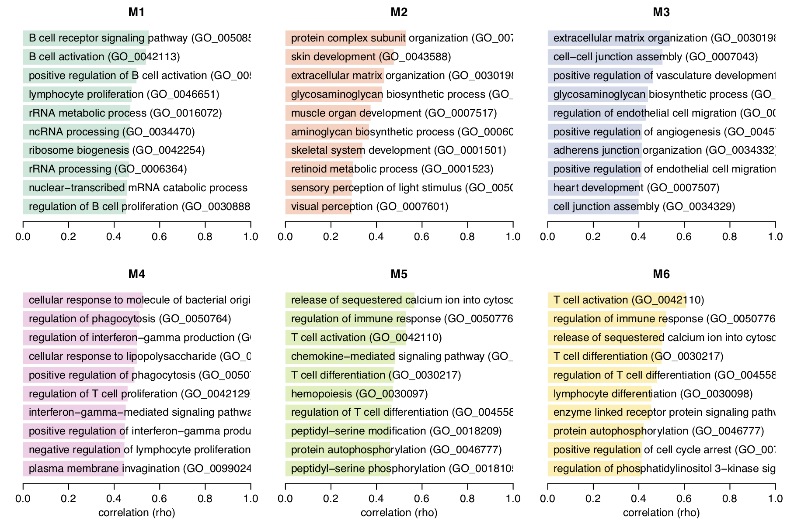

**Figure 7**. Enrichment annotation of corresponding heatmap clusters from the `Figure 6`_.
To reproduce the figure on the platform, generate the heatmap in `Figure 6`_ first, 
then go to the **Annotate clusters** panel. From the plot *Settings*, 
set the :option:`Reference set: GOBP`.

Bulk RNA-seq Data
--------------------------------------------------------------------------------
To elucidate the mechanism of action of a new drug, or for the intention of drug
repurposing, it is often useful to find other drugs that have similar or opposing
signatures compared to some given fold change profile. 
This example is illustriated using the RNA-sequencing dataset 
`GSE114716 <https://www.ncbi.nlm.nih.gov/geo/query/acc.cgi?acc=GSE114716>`__ from
`Goswami et al. <https://www.ncbi.nlm.nih.gov/pubmed/29905573>`__, 
which contains CD4 T cells following ipilimumab therapy.
`Figure 8`_ shows the top ranked drugs with most similar or most opposing signatures
to ipilimumab, a novel monoclonal antibody targeting CTLA-4 used in tumour therapy
to stimulate the immune system. The complete list contains several compounds that
stimulate the immune system, such as alpha-tocopherol 
(`Morel et al. <https://www.sciencedirect.com/science/article/pii/S0264410X11000399>`__), 
but also highlights compounds that are not commonly associated with the modulation
of immune responses, such as strophanthidin, an intropic drug that has recently
been shown to display pro-inflammatory activities  
(`Karas et al. <https://www.sciencedirect.com/science/article/pii/S0378427418314863>`__).

Drug enrichment profiles
~~~~~~~~~~~~~~~~~~~~~~~~~~~~~~~~~~~~~~~~~~~~~~~~~~~~~~~~~~~~~~~~~~~~~~~~~~~~~~~~

.. _`Figure 8`: 

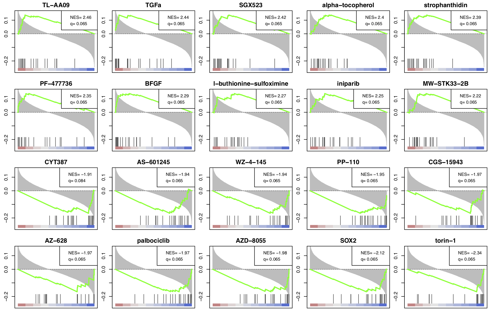

**Figure 8**. Drug enrichment profiles for most similar and opposing drugs
compared to ipilimumab treatment.
To reobtain the figure on the platform, select and load 
:option:`GSE114716-ipilimumab` dataset, go to the **Drug CMap** panel 
under the **Functional** module,
and set the :option:`Contrast: Ipi_vs_baseline` from the plot *Settings*.

    
Microarray Data
--------------------------------------------------------------------------------
In this section, we perform the heatmap clustering, biomarker selection and 
survival analysis using
the `GSE10846 <https://www.ncbi.nlm.nih.gov/geo/query/acc.cgi?acc=GSE10846>`__
from `Lenz et al. <https://www.ncbi.nlm.nih.gov/pubmed/19038878>`__,
which is the microarray gene expression dataset of diffuse large B-cell 
lymphoma (DLBCL) patients.
`Figure 9`_ shows a hierarchical cluster heatmap of microarray gene
expression data. `Figure 10`_ and `Figure 11`_ show the variable importance 
plot and a survival tree on the overall survival of the DLBCL patients,
respectively.

Hierarchical cluster heatmap
~~~~~~~~~~~~~~~~~~~~~~~~~~~~~~~~~~~~~~~~~~~~~~~~~~~~~~~~~~~~~~~~~~~~~~~~~~~~~~~~

.. _`Figure 9`: 

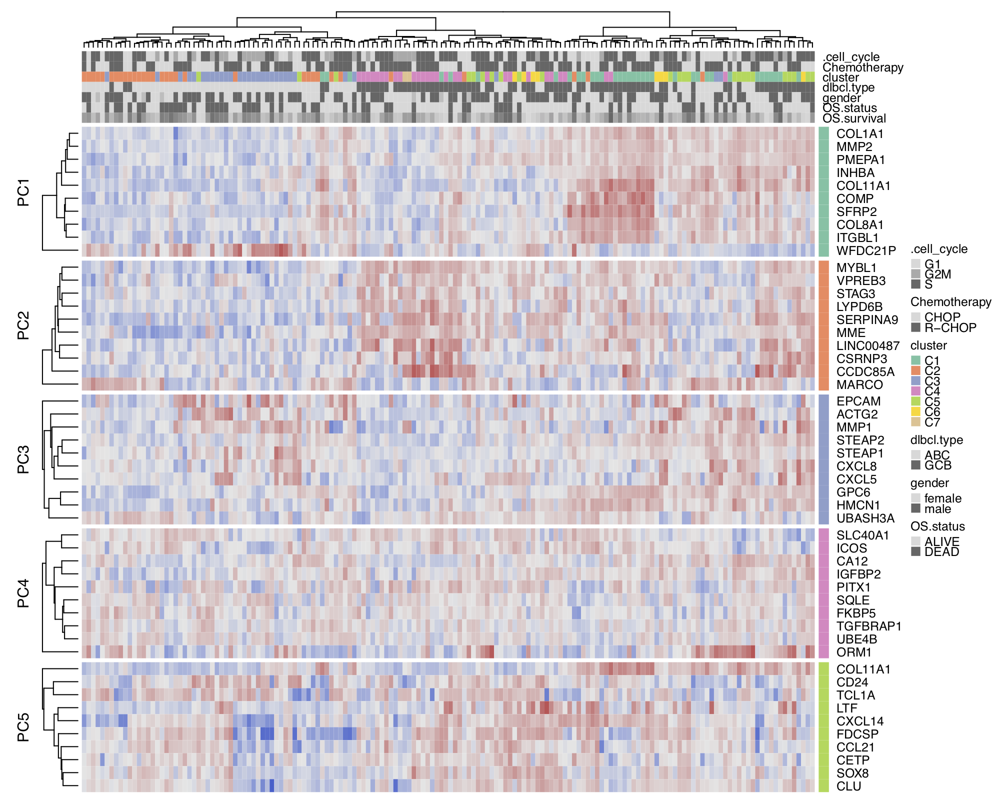

**Figure 9**. Hierarchical cluster heatmap for :option:`GSE10846-dlbcl` dataset.
To replicate the figure, select and load :option:`GSE10846-dlbcl`
dataset on the platform. Go to the **Heatmap** panel of the **Clustering** module,
and set the :option:`Level: gene` and :option:`Features: all` from the input panel.
In the plot *Settings*, set the :option:`split by: none` and :option:`Top mode: pca`.

Variable importance plot
~~~~~~~~~~~~~~~~~~~~~~~~~~~~~~~~~~~~~~~~~~~~~~~~~~~~~~~~~~~~~~~~~~~~~~~~~~~~~~~~

.. _`Figure 10`: 

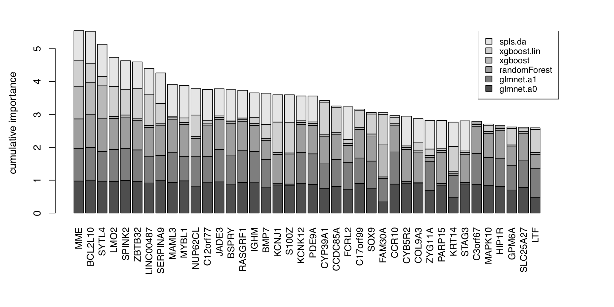

**Figure 10**. Variable importance plot.
To replicate the figure, go to the **Biomarker** module,
and set the :option:`Predicted target: dlbcl.type` from the input panel.

Survival tree
~~~~~~~~~~~~~~~~~~~~~~~~~~~~~~~~~~~~~~~~~~~~~~~~~~~~~~~~~~~~~~~~~~~~~~~~~~~~~~~~

.. _`Figure 11`: 

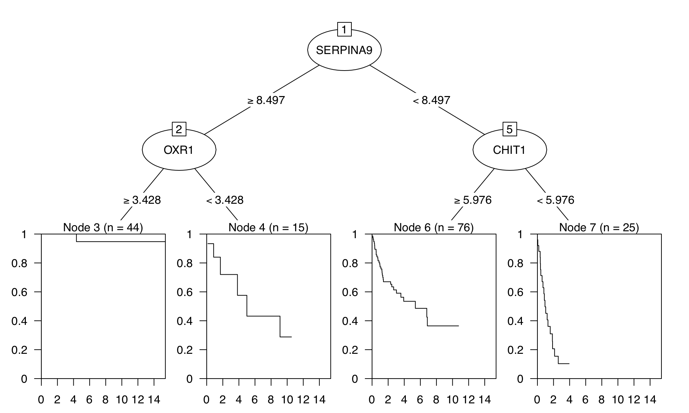
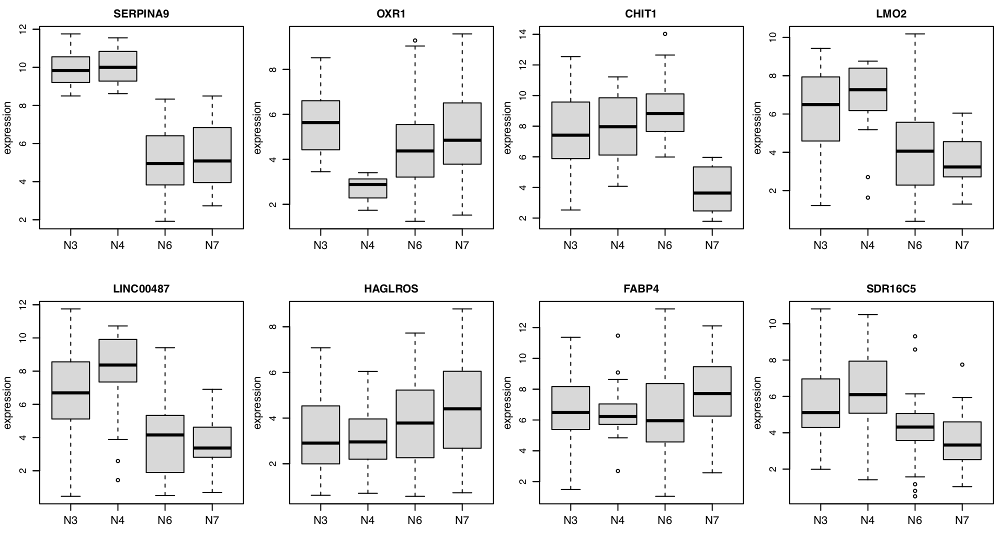
    
**Figure 11**. Survival tree analysis for :option:`GSE10846-dlbcl` dataset.
To redproduce similar figures, go to the **Biomarker** module,
and set the :option:`Predicted target: OS.survival` from the input panel.
Note that the survival tree is stochastically built up with some of the top
features shown in `Figure 10`_; Therefore, users can get a slightly different survival
tree every time.

Proteomic Data
--------------------------------------------------------------------------------
With larger data sets, often the number of contrasts increases and complicates 
the overall analysis. For example, the proteomics data set of 
`Rieckmann et al. 2017 <https://www.ncbi.nlm.nih.gov/pubmed/28263321>`__
comprises 26 populations of seven major immune cell types, measured during resting
and activated states. There are more than 300 possible comparisons to make.
To gain a better overview, gene set activation matrix (`Figure 12`_) help 
visualize the similarities between multiple contrasts on a functional level. 
Alternatively, similarities can be visualized as a connectivity graph (`Figure 13`_). 
For the same data set, `Figure 14`_ shows a computed partition tree that classifies 
the major cell types.

Another example dataset is from 
`Geiger et al. <https://www.ncbi.nlm.nih.gov/pubmed/27745970>`__, 
where the proteome profiles 
of activated vs resting human naive T cells at different times were compared.
`Figure 15`_ shows the volcano plots corresponding to eight different statistical tests
comparing time-dependent activation of T cells at 48h vs. 12h. We see that 
both standard t-test and the Welch t-test show much less power to detect 
significant genes compared to the other methods. The result from edgeR-QLF 
is close to those of the two limma based methods, while edgeR-LRT is very 
similar to the results of DESeq2-Wald.

Activation matrix
~~~~~~~~~~~~~~~~~~~~~~~~~~~~~~~~~~~~~~~~~~~~~~~~~~~~~~~~~~~~~~~~~~~~~~~~~~~~~~~~

.. _`Figure 12`: 

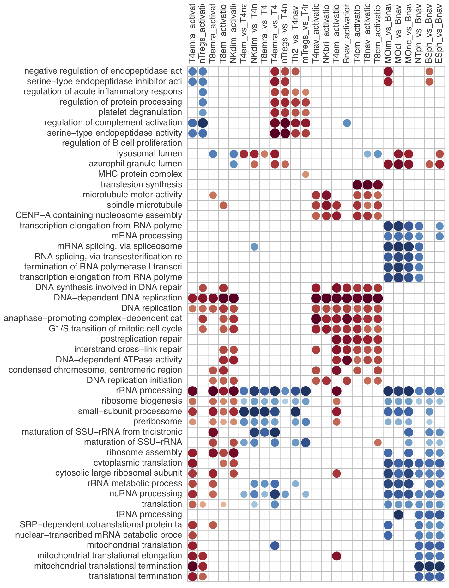

**Figure 12**. Gene Ontology activation matrix.
To replicate the figure, select and load the :option:`rieckmann2017-immprot` 
dataset, and go to the **GO graph** panel of the **Functional** module
with default settings.

Contrast heatmap
~~~~~~~~~~~~~~~~~~~~~~~~~~~~~~~~~~~~~~~~~~~~~~~~~~~~~~~~~~~~~~~~~~~~~~~~~~~~~~~~

.. _`Figure 13`: 

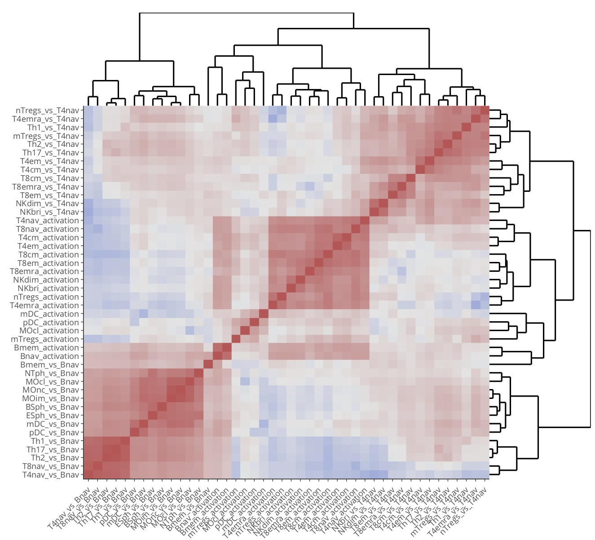

**Figure 13**. Contrast heatmap for the :option:`rieckmann2017-immprot` dataset.
To generate the figure on the platform, go to the **Contrast heatmap** panel of
the **Intersection** module with default settings.

Classification tree
~~~~~~~~~~~~~~~~~~~~~~~~~~~~~~~~~~~~~~~~~~~~~~~~~~~~~~~~~~~~~~~~~~~~~~~~~~~~~~~~

.. _`Figure 14`: 

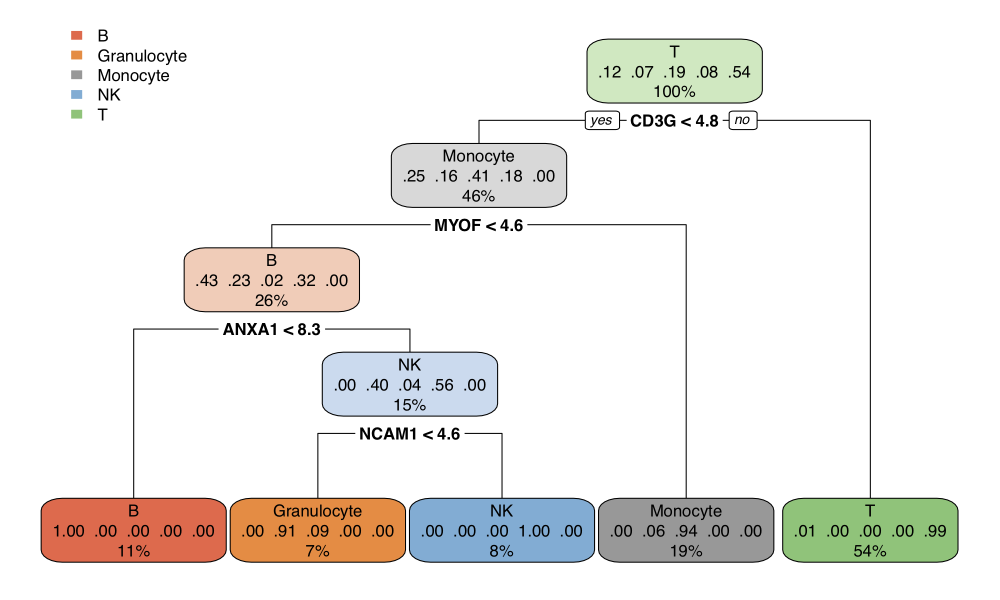
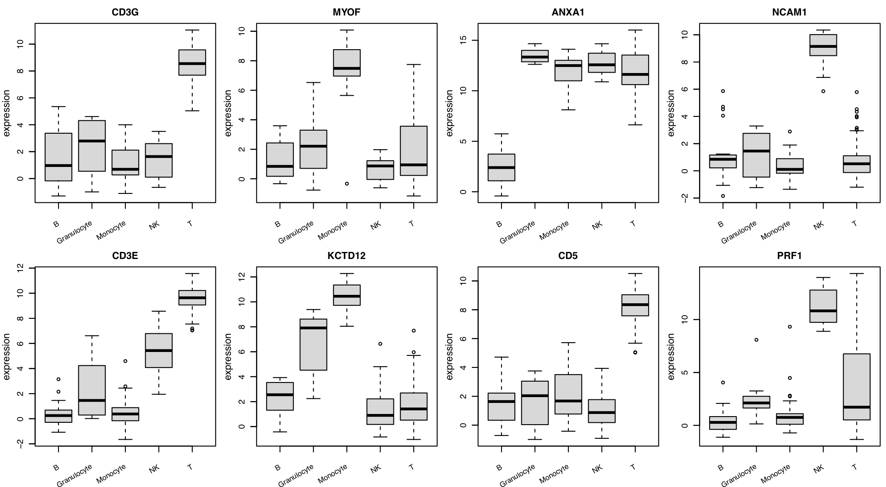

**Figure 14**. Classification tree for the :option:`rieckmann2017-immprot` dataset.
To reproduce similar figures, go to the **Biomarker** module, and set the 
:option:`Predicted target: cell.type` from the input panel.
Note that the classification tree is stochastically built up with some of the top
features shown in `Figure 10`_; Therefore, users can get a slightly different survival
tree every time.

Volcano plots of methods
~~~~~~~~~~~~~~~~~~~~~~~~~~~~~~~~~~~~~~~~~~~~~~~~~~~~~~~~~~~~~~~~~~~~~~~~~~~~~~~~

.. _`Figure 15`: 

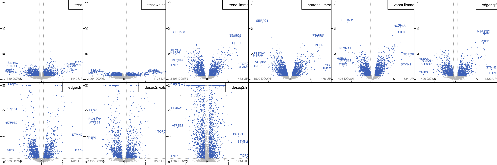

**Figure 15**. Volcano plots corresponding to eight different statistical 
methods comparing time-dependent expression of T cell activation at 48h vs. 12h.
To regenerate the figure, select and load :option:`geiger2016-arginine` dataset.
Go to the **Volcano (methods)** panel under the 
**Expression** module, and set the :option:`Contrast: act48h_vs_act12h`.
