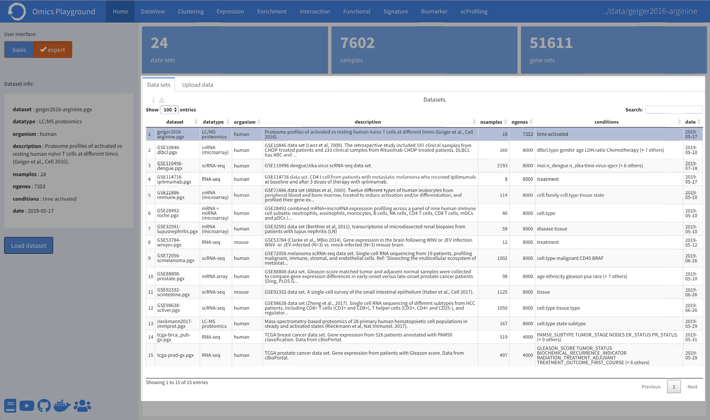

.. _Home:

Home Panel
================================================================================

Selecting the user interface mode
--------------------------------------------------------------------------------

User can select BASIC or ADVANCED user mode. The basic mode should be
sufficient for most users. The advanced mode presents extra
visualization panels and enables more custom options. The advanced
mode also has specialized analysis modules for single-cell RNA-seq,
immune cell profiling and signature analysis.

.. figure:: figures/psc1.1.png
    :align: center
    :width: 20%
    
Selecting the dataset
--------------------------------------------------------------------------------

The platform starts running from the **Home** panel. This panel shows
the available datasets within the platform. The table reports a brief
description as well as the total number of samples, genes, gene sets
(or pathways), corresponding phenotypes and the collection date.

Users can select a dataset in the table. The ``Dataset info`` shows
the information of the dataset of interest and users can load the data
by clicking the ``Load dataset`` button.

.. figure:: figures/psc1.0.png
    :align: center
    :width: 40%

Upload data
--------------------------------------------------------------------------------

Under the **Upload data** panel users can upload their transcriptomics
and proteomics data to the platform. The platform requires 4 data
files as listed below: a data file containing counts/expression
(counts.csv), a sample information file (samples.csv), a gene
annotation file (genes.csv) and a file specifying the statistical
comparisons as contrasts (contrasts.csv). It is important to name the
files exactly as shown. The file format must be comma-separated-values
(CSV) text.  Be sure the dimensions, rownames and column names match
for all files.  On the left side of the panel, users need to provide a
unique name and brief description for the dataset while uploading.

:**counts.csv**: Count/expression file with gene on rows, samples as columns.
:**samples.csv**: Samples file with samples on rows, phenotypes as columns.
:**genes.csv**: Gene information file with genes on rows, gene info as columns.
:**contrasts.csv**: Contrast file with conditions on rows, contrasts as columns.

.. figure:: ../modules/figures/psc1.3.png
    :align: center
    :width: 100%

Useful links
--------------------------------------------------------------------------------
In the bottom-left corner of the **Home panel**, users can find some useful
links regarding the Omics Playground, including the 
`online documentation <https://omicsplayground.readthedocs.io>`__ at Read-the-docs, 
`video tutorials <https://www.youtube.com/watch?v=_Q2LJmb2ihU&list=PLxQDY_RmvM2JYPjdJnyLUpOStnXkWTSQ->`__ on YouTube, 
the `source code <https://github.com/bigomics/omicsplayground>`__ at GitHub, 
the `docker file <https://hub.docker.com/r/bigomics/omicsplayground>`__ at Docker hub, 
and the `user forum <https://groups.google.com/forum/#!forum/omics-playground>`__ 
at Google groups to get some help.

