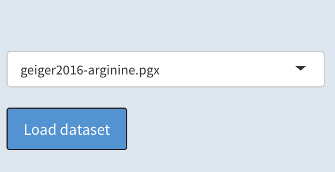
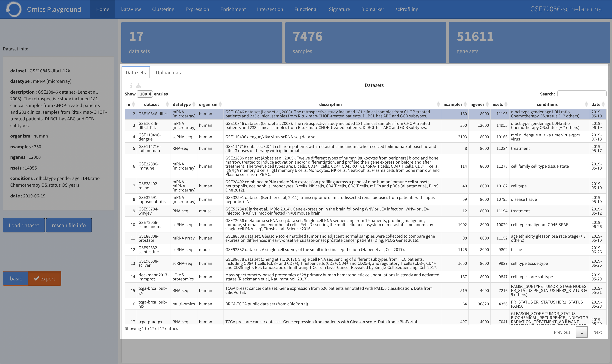

.. _Home:

Home
================================================================================

The platform starts running from the **home** page. Basically, this module contains 
general information about all available datasets within the platform. 
Users can select and load the data of their interest from the input slider on the left
and start the analysis.

For each dataset in the platform, the table reports a brief description as well 
as the total number of samples, genes, gene sets (or pathways), corresponding 
phenotypes and the collection date.

