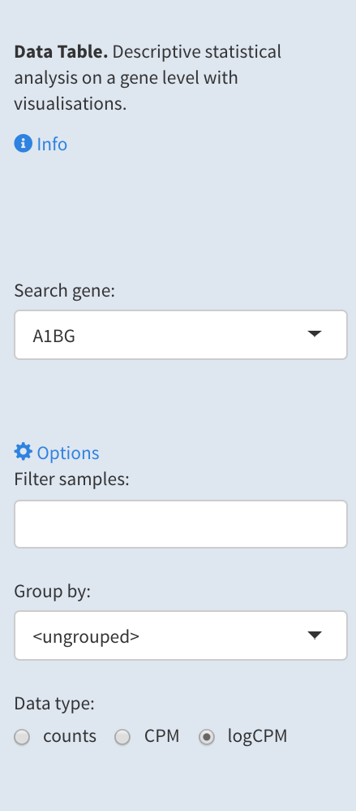
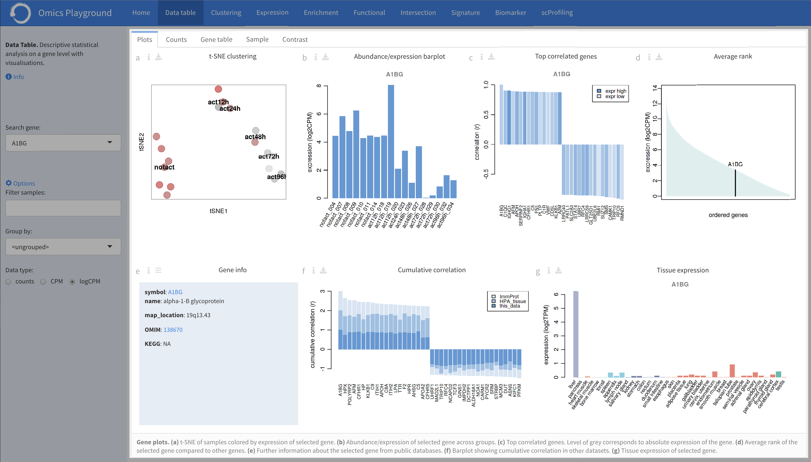
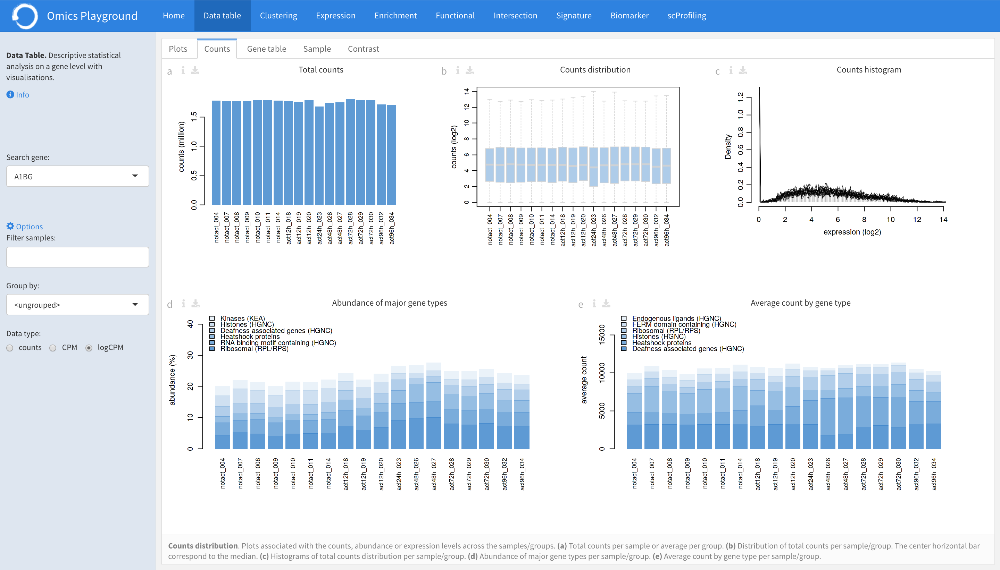
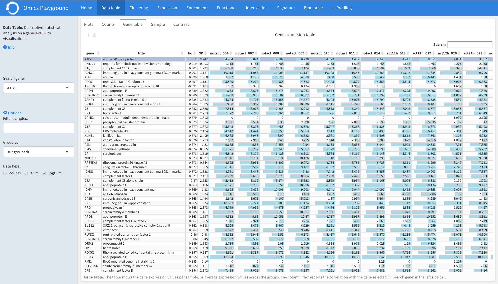
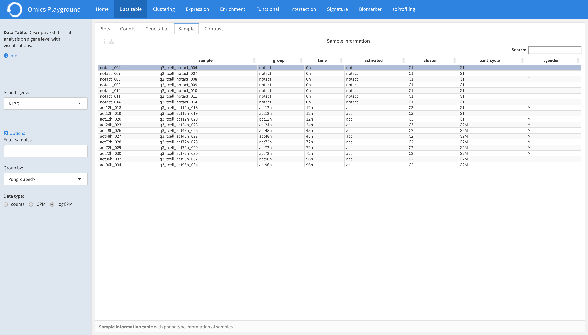
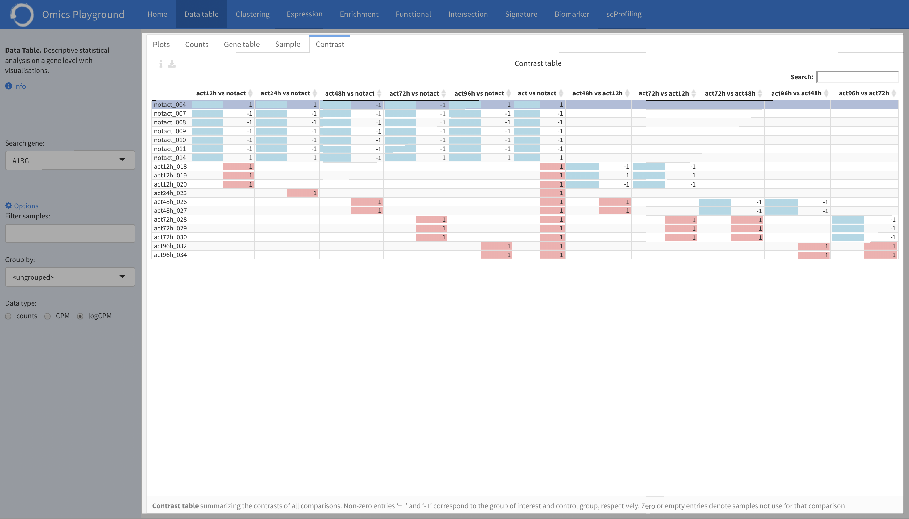

.. _DataView:

Data View
================================================================================

The **DataView** module provides information and visualisations of the dataset to 
quickly lookup a gene, check the counts, or view the data tables.
It has five panels, which are briefly explained below, followed by
more detailed information for each panel.

The **Plots** panel displays figures related to the expression level
of the selected gene, correlation, and average expression ranking
within the dataset.  In the **Counts** panel, the total number of
counts (abundance) per sample and their distribution among the samples
are displayed. This is most useful to check the technical quality of
the dataset, such as total read counts or abundance of ribosomal
genes. In **Gene rable** panel, the exact expression values across the
samples can be looked up, where genes are ordered by the correlation
with respect to the first gene. Gene-wise average expression of a
phenotype sample grouping is also presented in this table. In the
**Samples** panel, more complete information about samples can be
found. Finally, the **Contrasts** panel, shows information about the
phenotype comparisons.

Input panel
--------------------------------------------------------------------------------
Users can find more information about the module by clicking the
``Info`` button on the left side . The panel contains the main
settings for the analysis. The analysis can be started by selecting a
gene of interest from the ``Search gene`` settings. Under the
*Options*, users can filter and select samples in the ``Filter
samples`` settings, or collapse the samples by predetermined groups in
the ``Group by`` settings. It is also possible to visualize the
information on a raw count level, count per million (CPM), or
logarithmic expression level (logCPM).

Plots
--------------------------------------------------------------------------------

The **Plots** panel displays figures related to the expression level
of the selected gene, correlation to other genes, and average
expression ranking within the dataset.  To find out more information
from the literature, hyperlinks are provide to connect the selected
gene to `OMIM <https://www.ncbi.nlm.nih.gov/omim/>`__, `KEGG
<https://www.ncbi.nlm.nih.gov/pmc/articles/PMC102409/>`__, and `GO
<http://geneontology.org/>`__ databases.  It also shows the
correlation of the gene in other datasets such as `ImmProt
<https://www.ncbi.nlm.nih.gov/pubmed/28263321>`__ and `HPA
<https://www.nature.com/articles/nbt1210-1248>`__, and plots the
cumulative correlation. Furthermore, it displays the tissue expression
for a selected gene using the genotype-tissue expression `GTEx
<https://www.ncbi.nlm.nih.gov/pubmed/23715323>`__ dataset.  For each
chart of the panel, a detailed explanation is provided below.

:**a**: T-SNE clustering of samples (or cells) colored by an expression of the 
        gene selected in the ``Search gene`` dropdown menu. The red color 
        represents an over-expression of the selected gene across samples (or cells). 

:**b**: Expression barplot of grouped samples (or cells) for the selected gene. 
        Samples (or cells) in the barplot can 
        be ungrouped by setting the ``Group by`` under the main *Options*.

:**c**: Barplot of the top positively and negatively correlated genes 
        with the selected gene. Absolute expression levels 
        of genes are colored in the barplot, where the low and high expressions 
        range between the light grey and dark black colors, respectively.

:**d**: Ranking of the average expression of the selected gene.

:**e**: To find out more information from the literature, hyperlinks are provide to 
        connect the selected gene to public databases, 
        including `OMIM <https://www.ncbi.nlm.nih.gov/omim/>`__, 
        `KEGG <https://www.ncbi.nlm.nih.gov/pmc/articles/PMC102409/>`__, 
        and `GO <http://geneontology.org/>`__.

:**f**: Top cumulative positively and negatively correlated genes with the
        selected gene, across samples (or cells), 
        in the current dataset as well as in public datasets such as 
        `ImmProt <https://www.ncbi.nlm.nih.gov/pubmed/28263321>`__ 
        and `HPA <https://www.nature.com/articles/nbt1210-1248>`__. 
        The bars are colored by dataset. 
        
:**g**: Tissue expression for the selected gene in the tissue expression 
        `GTEx <https://www.ncbi.nlm.nih.gov/pubmed/23715323>`__ database. 
        Colors corresponds to "tissue clusters" as computed by unsupervised clustering.

Counts
--------------------------------------------------------------------------------

In the **Counts** panel, the total number of counts (abundance) per
sample and their distribution among the samples are displayed. For
each sample, users can also see the percentage of counts in terms of
major gene types such as ribosomal genes, heatshock proteins, or
kinases. Abnormal abundance of certain genes may indicate technical
problems. A detailed explanation is provided below for every chart of
the panel.

:**a**: A barplot of the total number of counts (abundance) for each group. 
        The samples (or cells) can be grouped/ungrouped in the ``Group by``
        setting uder the main *Options*.

:**b**: A boxplot of the total number of counts (abundance) for each group.

:**c**: A histogram of the total number of counts (abundance) for each group.

:**d**: A barplot showing the percentage of counts in terms of major gene 
        types such as CD molecules, kinanses or RNA binding motifs for 
        each group. 

:**e**: A barplot showing the average count levels of major gene types such
        as CD molecules, kinanses or RNA binding motifs for each group. 

Gene table
--------------------------------------------------------------------------------
Under the **Gene table** panel, the exact expression values across the
samples can be read, where genes are ordered by the correlation with
respect to the first gene.  Gene-wise average expression of a
phenotype sample grouping is also presented in this table.

The samples (or cells) in the table can be ungrouped by setting the
``Group by`` under the main *Options* to see the exact expression
values per sample (or cell).  The genes in the table are ordered by
the correlation (**rho** column) with respect to the selected gene.
**SD** column reports the standard deviation of expression across
*all* samples (or cells).

Samples
--------------------------------------------------------------------------------

In the **Samples** panel, users can check information about samples
and their phenotype grouping.

    

Contrasts
--------------------------------------------------------------------------------

In the **Contrasts** panel, more complete information about contrasts can be found.
It summarizes the contrasts of all comparisons. Here, users can check which samples
belong to which groups for the different comparisons. Non-zero entries '+1' and '-1' 
correspond to the group of interest and control group, respectively. 
Zero or empty entries denote samples not use for that comparison.

