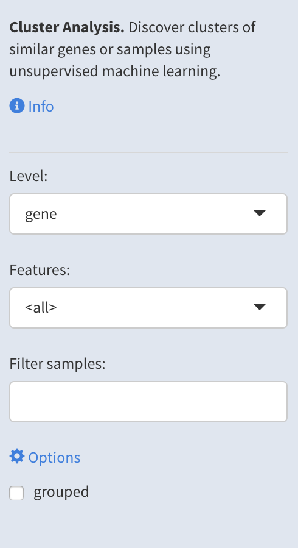
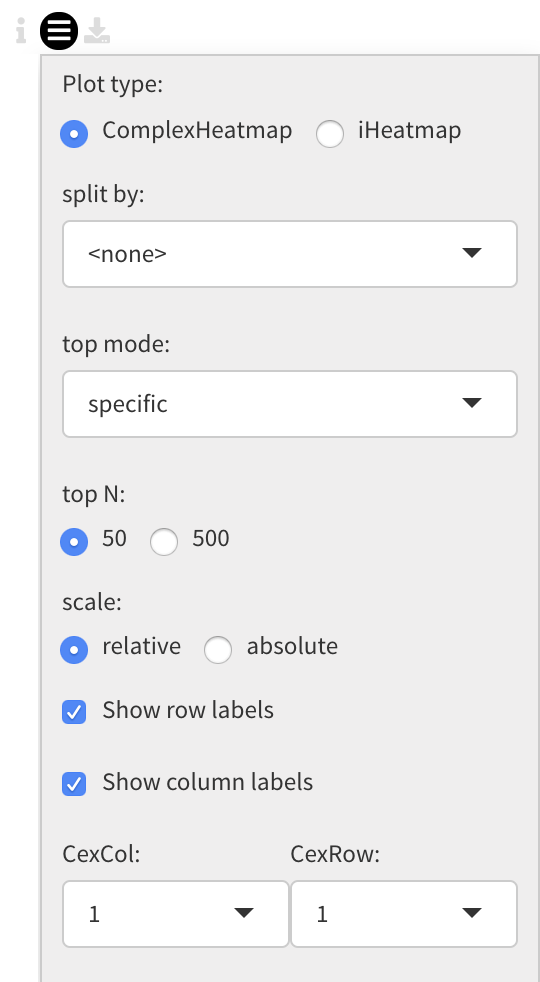
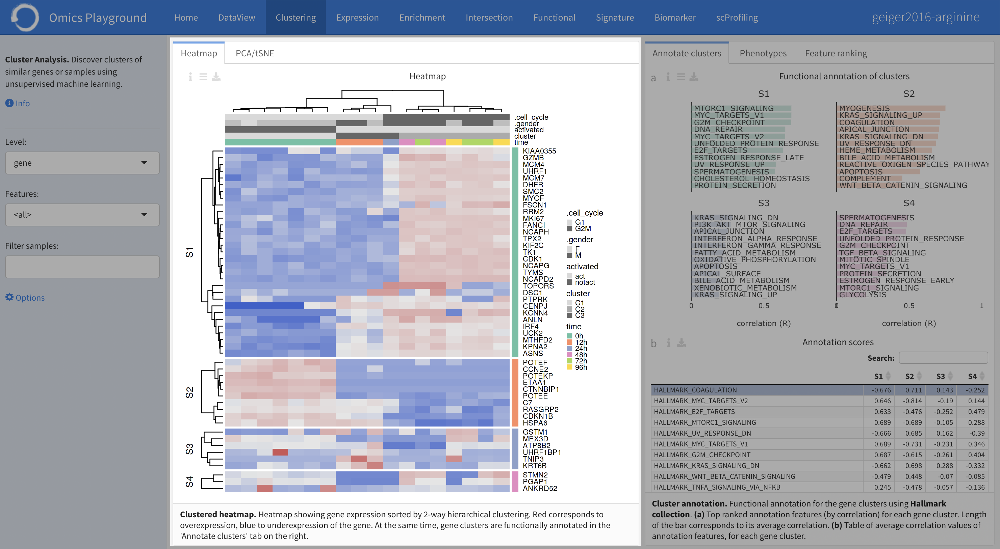
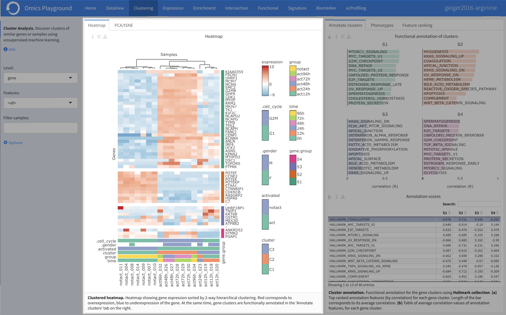
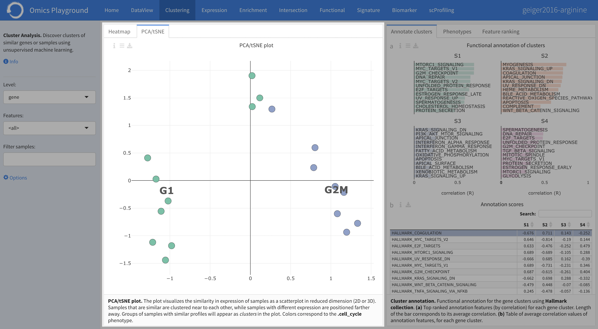
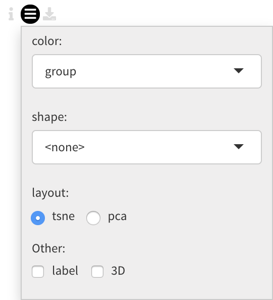
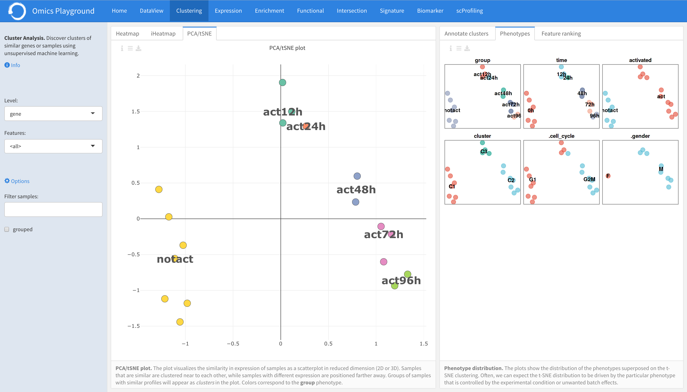
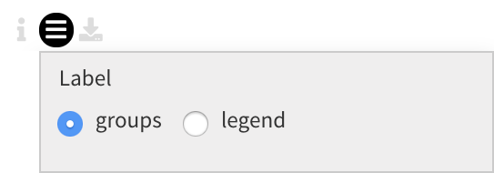
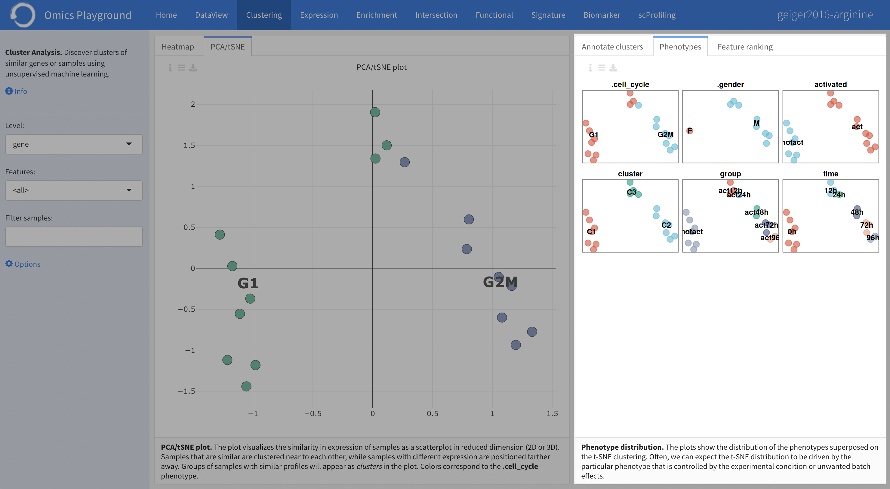
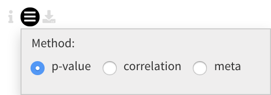

.. _Clustering:

Clustering Analysis
================================================================================

The **Cluster Analysis** module performs unsupervised clustering analysis of the data. 
After having done the QC, it is probably the first way to explore your data. 
The main purpose is to discover patterns and subgroups in the data, show correlation
with known phenotypes, detect outliers, or investigate batch effects.

In the **Heatmap** panel hierarchical clustering can be performed on gene level 
or gene set level. During the heatmap generation, the platform provides a functional
annotation for each feature cluster in **Annotate cluster** panel, where users can
select from a variety of annotation databases from the literature. 
The **PCA/tSNE** panel shows unsupervised clustering of the samples in 2D/3D as
obtained by PCA or tSNE algorithms. 
The **Phenotypes** panel on the right, shows the phenotype distribution as colors
on the t-SNE plot.

.. note::

    EXPERT MODE ONLY: The **Feature ranking** panel computes a discriminant 
    score for gene (or geneset) families. This allows to investigate what 
    family of genes (or gene sets) can best discriminate the groups.

Input slider
--------------------------------------------------------------------------------
Users can find more information by clicking ``Info`` in the input slider. 
It also contains settings for the analysis, where users can 
specify the level analysis in the ``Level`` and select a family of features
in the ``Features``. Furthermore, under the *Options*,
it is possible to filter the relevant 
samples in the ``Filter samples`` and group the samples by a predefined 
phenotype class in the ``grouped``.

Heatmap
--------------------------------------------------------------------------------
In the **Heatmap** panel hierarchical clustering can be performed on gene level
or gene set level expression in which for the latter, for each gene set (or pathway),
an average expression is computed from the gene expression data using summary methods
such as `GSVA <https://bmcbioinformatics.biomedcentral.com/articles/10.1186/1471-2105-14-7>`__
and `ssGSEA <https://bmcbioinformatics.biomedcentral.com/articles/10.1186/1471-2105-14-7>`__. 

Under the plot configuration *Settings*, users can split the samples by a phenotype
class (e.g., tissue, cell type, or gender) using the ``split`` by setting. 
In addition, users can specify the top N = (50, 500) features to be used in the heatmap. 
The ordering of top features is selected under ``top mode``. 
The criteria to select the top features are:

* SD - features with the highest standard deviation across all the samples,
* specific - features that are overexpressed in each phenotype class compared to the rest, or by
* PCA - by principal components.

Users can also choose between 'relative' or 'absolute' expression scale. 
Under the ``CexCol`` and ``CexRow`` settings, it is also possible to adjust the cex 
for the column and row labels.

        
The complex heatmap below is generated after tuning the options and settings. 
It is a clustered heatmap showing gene expression sorted by 2-way hierarchical
clustering. Red corresponds to overexpression, blue to underexpression of the gene.
At the same time, gene clusters are functionally annotated in the **Annotate clusters**
panel on the right.

iHeatmap
--------------------------------------------------------------------------------
The **iHeatmap** is an interactive version of the **Heatmap** panel. 
All figure configurations and settings are also controlled via 'Heatmap' panel.
It has only one ``Show row labels`` local setting to display the row labels of 
an interactive heatmap.

Annotate clusters
--------------------------------------------------------------------------------
The top features in the heatmap are then divided 
into five clusters based on their expression profiles. For each 
cluster, the platform provides a functional annotation under the
**Annotate cluster** section using more than 42 published reference 
databases, including but not limited to well-known databases such as 
`MSigDB <http://software.broadinstitute.org/gsea/msigdb/index.jsp>`__,
`KEGG <https://www.ncbi.nlm.nih.gov/pmc/articles/PMC102409/>`__, 
and `GO <http://geneontology.org/>`__. 
In the plot *Settings*, users can specify the level and reference 
set to be used under the ``Reference level`` and ``Reference set``
settings, respectively.

.. figure:: figures/psc3.3.0.png
    :align: center
    :width: 30%

The functional annotation for the clusters are displayed below, 
with the highest ranking annotation features (by correlation) 
displayed for each gene cluster. 
Length of the bar corresponds to its average correlation.
Furthermore, users can see the average correlation values of annotation
features for each cluster.

PCA/tSNE
--------------------------------------------------------------------------------
The **PCA/tSNE** panel visualizes unsupervised clustering obtained by the principal
components analysis (`PCA <https://www.ncbi.nlm.nih.gov/pubmed/19377034>`__) or 
t-distributed stochastic embedding 
(`tSNE <http://jmlr.org/papers/volume15/vandermaaten14a/vandermaaten14a.pdf>`__) algorithms. 
This plot shows the relationship (or similarity) between the samples for visual 
analytics, where similarity is visualized as proximity of the points. 
Samples that are 'similar' will be placed close to each other.

Users can customise the PCA/tSNE plot in the *Settings*, 
including the ``color`` and ``shape`` of points using a phenotype class,
choose t-SNE or PCA ``layout``, label the points, or display 2D and 3D
visualisation of the PCA/tSNE plot.

Based on their configuration settings, users will obtain similar PCA/tSNE plots below.

    

Phenotypes
--------------------------------------------------------------------------------
The **Phenotypes** panel visualizes the distribution of the available phenotype data. 
It provides plots showing the distribution of the phenotypes superposed on the 
tSNE clustering. Often, we can expect the t-SNE distribution to be driven by the
particular phenotype that is controlled by the experimental condition or unwanted
batch effects. Users can choose to put the group labels in the 
figure or as separate legend in the ``Label`` setting, under the plot *Settings*.

The output figure of the panel (phenotype distribution) is shown below. 
    

Feature ranking
--------------------------------------------------------------------------------
The **Feature ranking** provides the ranked discriminant score for top feature sets.
It ranks the discriminitive power of the feature set (genes or gene sets) as a 
cumulative discriminant score for all phenotype variables. 
In this way, we can find which feature set (gene or gene family/set) can explain 
the variance in the data the best.

Under the plot configuration *Settings*, users can specify the ``Method`` for 
computing the discriminant score.

* P-value based scoring is computed as the average negative log p-value from the ANOVA.
* Correlation-based discriminative power is calculated as the average '(1-cor)' 
  between the groups. Thus, a feature set is highly discriminative if the 
  between-group correlation is low.
* The 'meta' method combines the score of the former methods in a multiplicative manner.
 

The following plot represents the resulting feature-set ranking.

.. figure:: figures/psc3.6.png
    :align: center
    :width: 100%