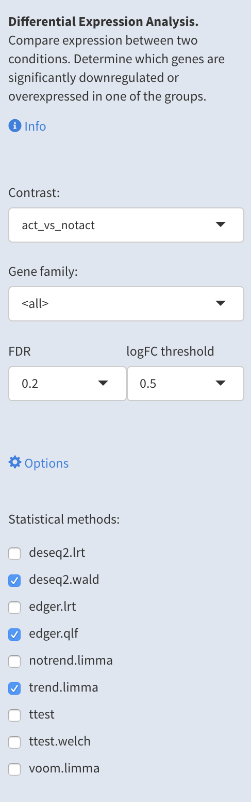
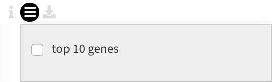
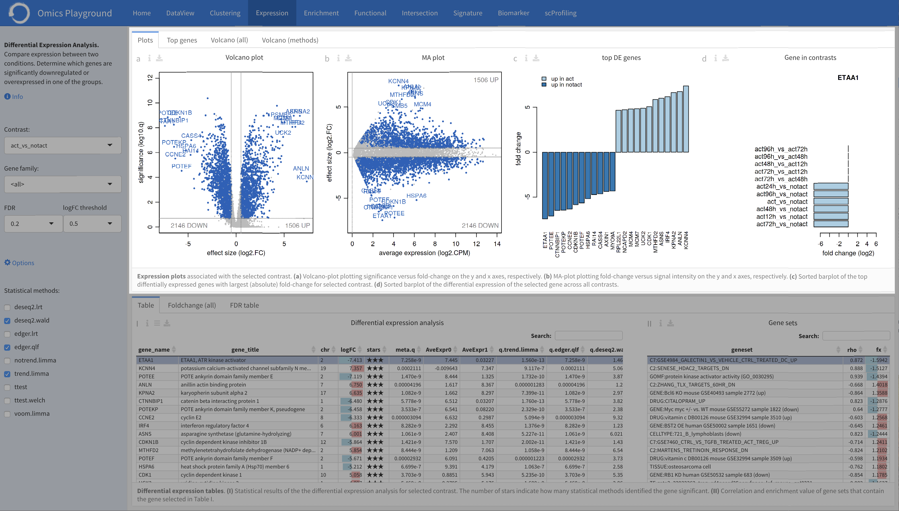
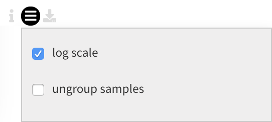
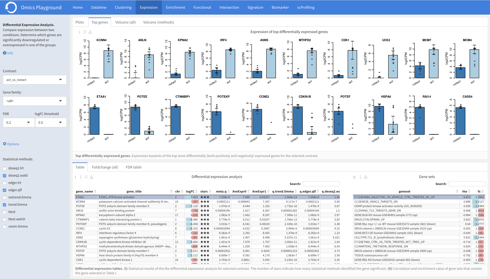
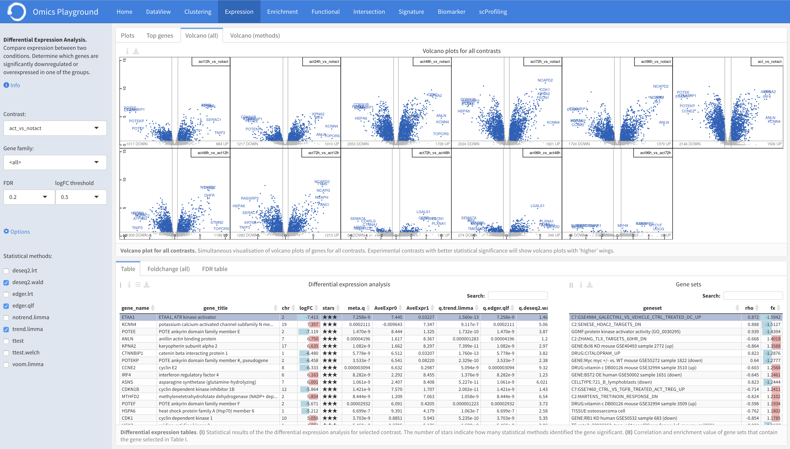
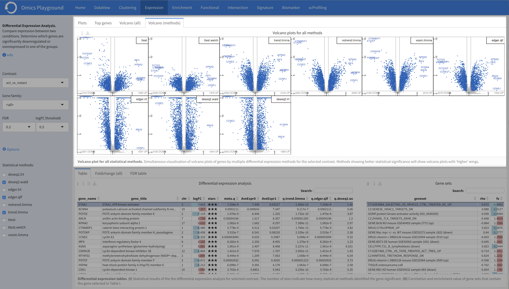
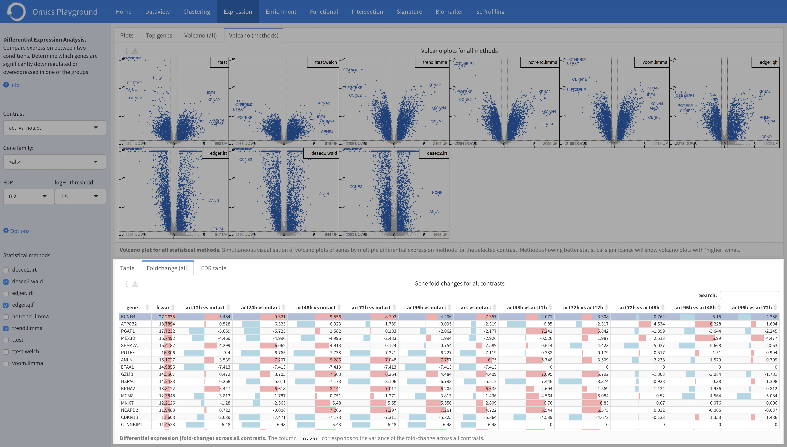
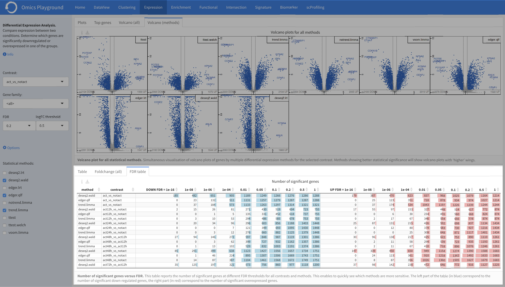

.. _DEGs:

Differential Expression Analysis
================================================================================
The **Differential Expression Analysis** module compares expression between two 
conditions (i.e. tumor versus control), which is one of the fundamental analysis 
in the transcriptomics data analytics workflow. For each comparison of two 
conditions (also called 'contrast'), the analysis identifies which genes are 
significantly downregulated or overexpressed in one of the groups.

The **Plots** panel shows volcano and MA plots for the chosen contrast. 
It also shows the so-called 'signature', i.e. the top downregulated and overexpressed
genes, for that contrast. The **Top genes** panel shows the average expression plots 
across the samples for top differentially expressed genes within the selected 
comparison. A very useful feature of the platform is that it can display volcano 
plots for all comparisons simultaneously under the **Volcano (all)** panel. This provides
users an overview of the statistics of all comparisons. The **Table** panel on the 
bottom shows the results of the statistical tests. The **Foldchange (all)** panel
reports the gene fold changes for all contrasts.

.. note::

    EXPERT MODE ONLY: To compare the different statistical methods, the **Volcano (methods)**
    panel shows volcano plots of all methods. The **FDR table** panel reports
    the number of significant genes at different FDR thresholds for all contrasts.

Input panle
--------------------------------------------------------------------------------
The input panel on the left contains the ``Info`` button for relevant information about
the module as well as some settings for the analysis. 
Users can start the differntial expression (DE) analysis by selecting a contrats of their 
interest in the ``Contrast`` and specifying a relevent gene family in the ``Gene family``.
It is possible to set the false discovery rate (FDR) and the logarithmic fold change 
(logFC) thresholds under the ``FDR`` and ``logFC threshold`` settings, respectively.

.. note::

    EXPERT MODE ONLY: We allow expert users to select a method for the DE statistical test
    under the main *Options*. 
    To increase the statistical reliability of the Omics Playground, we perform the DE 
    analysis using commonly accepted methods in the literature, including t-test 
    `t-test <https://en.wikipedia.org/wiki/Student%27s_t-test>`__ (standard, Welch), 
    `limma <https://www.ncbi.nlm.nih.gov/pubmed/25605792>`__ (no trend, trend, voom), 
    `edgeR <https://www.ncbi.nlm.nih.gov/pubmed/19910308>`__ (QLF, LRT), and 
    `DESeq2 <https://www.ncbi.nlm.nih.gov/pmc/articles/PMC4302049/>`__ (Wald, LRT),
    and merge the results.

Table
--------------------------------------------------------------------------------
Table ``I`` shows the results of the statistical tests slected in the 
``Statistical methods``. In the Basic mode, this table reports 
the meta (combined) results of 
`DESeq2 <https://www.ncbi.nlm.nih.gov/pmc/articles/PMC4302049/>`__ (Wald),
`edgeR <https://www.ncbi.nlm.nih.gov/pubmed/19910308>`__ (QLF), and 
`limma <https://www.ncbi.nlm.nih.gov/pubmed/25605792>`__ (trend) only.
Users can filter top N = {10} differently expressed genes in the table by 
clicking the ``top 10 genes`` from the table *Settings*.

    
For a selected comparison under the ``Contrast`` setting, the results of the selected 
methods are combined and reported in Table ``I``, where ``meta.q`` for a gene 
represents the highest ``q`` value among the methods and the number of stars for 
a gene indicate how many methods identified significant ``q`` values (``q < 0.05``). 
The table is interactive (scrollable, clickable); users can sort genes by ``logFC``, 
``meta.q``, or average expression in either conditions.

.. figure:: figures/psc4.1.png
    :align: center
    :width: 100%

By clicking on a gene in the Table ``I``, it is possible to see the correlation
and enrichment value of gene sets that contain the gene in Table ``II``.
Additionally, it is possible to check the differential expression status
in other comparisons from the ``Gene in contrasts`` plot under the **Plots** panel.

Plots
--------------------------------------------------------------------------------
The **Plots** panel provides figures such as Volcano plot, MA plot and sorted 
barplots associated with expression levels in the selected contrast.

:**a**: Volcano-plot showing the significance versus fold-change on the y and x axes, 
        respectively, for the selected comparison under the ``Contrast`` settings.  

:**b**: Application of a Bland-Altman (MA) plot showing the
        fold-change versus signal intensity on the y and x axes, respectively,
        for the selected comparison.  

:**c**: Sorted barplot of the top N = {12} differentially (both positively and negatively)
        expressed genes with largest (absolute) fold-change for the selected contrast.

:**d**: Sorted barplot of the differential expression of the selected gene under 
        the **Table** panel across all contrasts.

Top genes
--------------------------------------------------------------------------------
The **Top genes** panel shows the average expression plots across the samples 
for the top differentially (both positively and negatively) expressed genes
for the selected comparison from the ``Contrast`` settings. Under the plot *Settings*,
users can scale the abundance levels (counts) or ungroup the samples in the 
plot from the ``log scale`` and ``ungroup samples`` settings, respectively.

Average expression barplots for the top genes are displayed below. 

Volcano (all)
--------------------------------------------------------------------------------

Under the **Volcano (all)** panel, the platform simultaneously displays multiple 
volcano plots for genes across all contrasts. This provides users an overview 
of the statistics for all comparisons. By comparing multiple volcano plots, 
the user can immediately see which comparison is statistically weak or strong.
Experimental contrasts with better statistical significance will show 
volcano plots with 'higher' wings.

    
Volcano (methods)
--------------------------------------------------------------------------------    
The **Volcano (methods)** panel displays the volcano plots provided 
by multiple differential expression calculation methods for the selected contrast. 
This provides users an overview of the statistics of all methods at the same time.
Methods showing better statistical significance will show volcano 
plots with 'higher' wings.

    

Foldchange (all)
-------------------------------------------------------------------------------- 
The **Foldchange (all)** provides the differential expression (fold-change) of genes 
across all contrasts. The column ``fc.var`` corresponds to the variance of 
the fold-change across all contrasts.

FDR table
-------------------------------------------------------------------------------- 
The **FDR table** panel reports the number of significant genes at different 
FDR thresholds for all contrasts and methods. This enables to quickly see which 
methods are more sensitive. The left part of the table (in blue) correspond 
to the number of significant down-regulated genes, the right part (in red) 
correspond to the number of significant overexpressed genes.

    

    