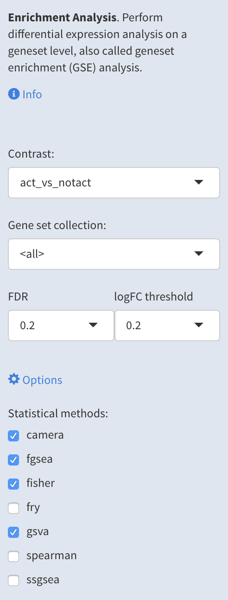
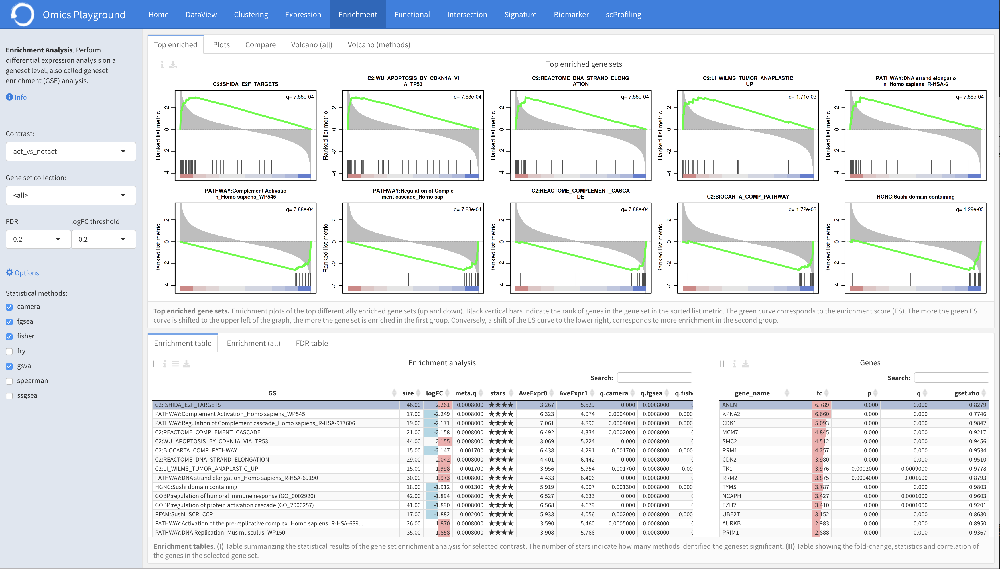
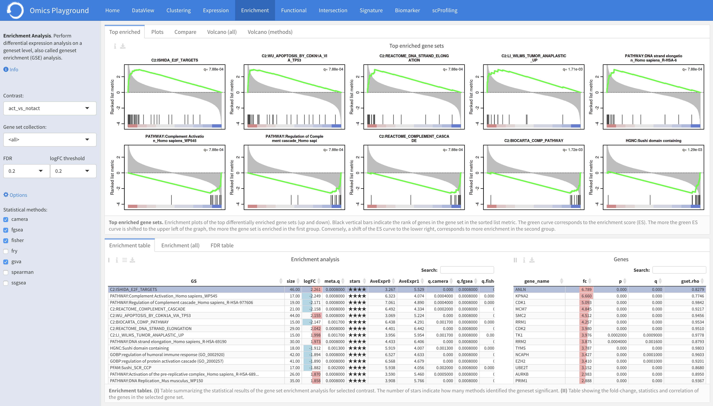
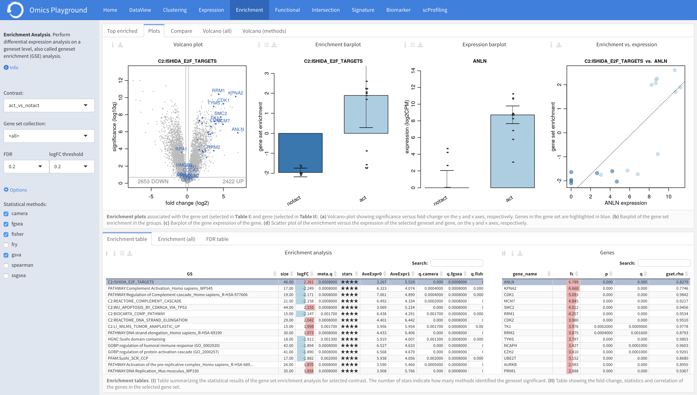
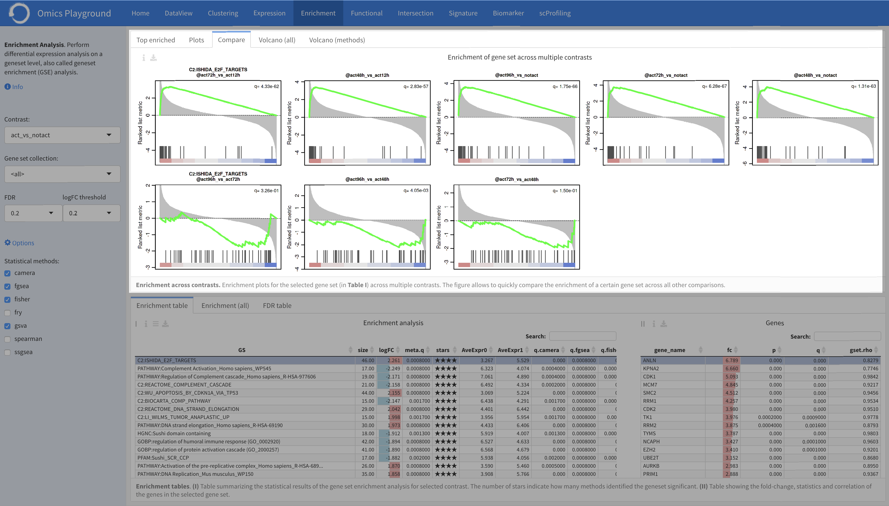
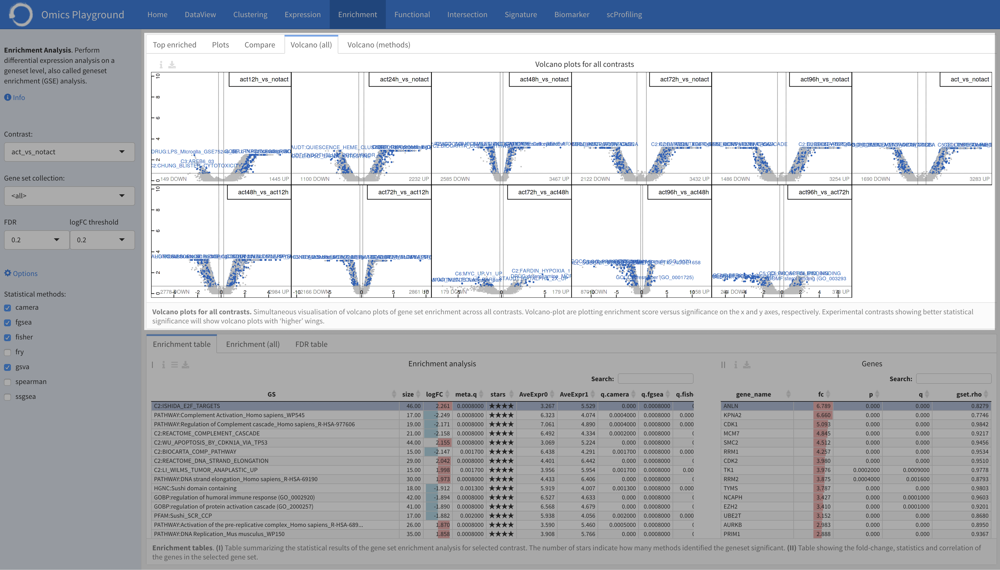
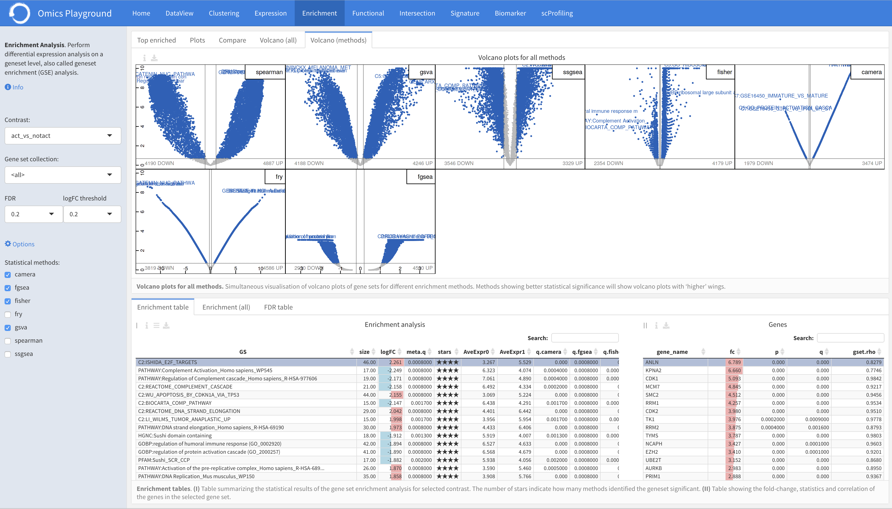
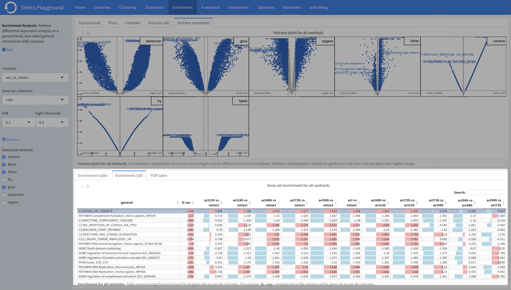
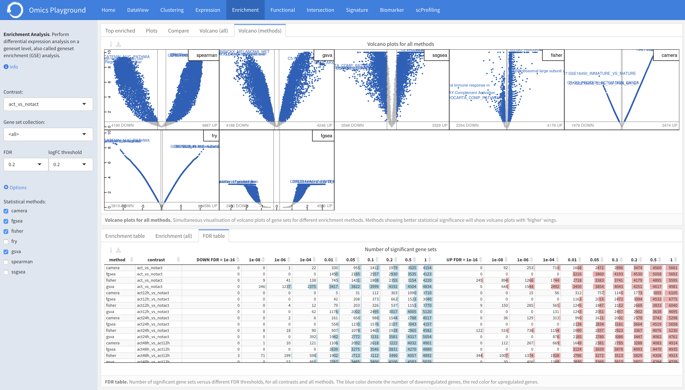

.. _DESGs:

Gene Set Enrichment Analysis
================================================================================
Similar to the differential gene expression analysis, users can perform differential
expression analysis on a geneset level in this page, which is also referred as 
gene set enrichment (GSE) analysis. The platform has more than 50.000 genesets 
(or pathways) in total that are divided into 30 geneset collections such 
`Hallmark <https://www.cell.com/abstract/S0092-8674(11)00127-9>`__, 
`MSigDB <http://software.broadinstitute.org/gsea/msigdb/index.jsp>`__,
`KEGG <https://www.ncbi.nlm.nih.gov/pmc/articles/PMC102409/>`__, 
and Gene Ontology (`GO <http://geneontology.org/>`__).
Users have to specify which comparison they want to visually analyze 
employing a certain geneset collection.

The enrichment analyses results from the statistical methods are 
displayed in **Enrichment table** panel. In the **Top enriched** panel, the top 
differentially enriched geneses (pathways) are displayed. In the **Plots** panel,
a volcano plot of genes contained in the selected geneset and a barplot of 
expressions per sample group are displayed. In the **Compare** panel, users can 
compare the differential expression status of that geneset for all other 
comparisons. Finally, volcano plots of genesets for all comparisons are 
displayed under the **Volcano (all)** tab. This allows users to have an overall 
picture across comparisons at the same time.

.. note::

    EXPERT MODE ONLY: To compare the different statistical methods, the **Volcano 
    (methods)** panel shows volcano plots of all methods. The **FDR table** panel 
    reports the number of significant gene sets at different FDR thresholds for all contrasts.

Input panel
--------------------------------------------------------------------------------
Users can find relevant information about the module in the ``Info`` from the input panel.
The enrichment analysis can be started by selecting a contrats of interest in 
the ``Contrast`` and specifying a relevent gene set family in the ``Gene set collection``.
It is possible to set the false discovery rate (FDR) and the logarithmic fold change 
(logFC) thresholds under the ``FDR`` and ``logFC threshold`` settings, respectively.

.. note::

    EXPERT MODE ONLY: 
    We allow expert users to select statistical methods for the enrichment 
    analysis under the main *Options*.
    To ensure the statistical reliability, the platform performs 
    enrichment analyses using multiple methods, including 
    `Spearman rank correlation <https://en.wikipedia.org/wiki/Spearman%27s_rank_correlation_coefficient>`__, 
    `GSVA <https://bmcbioinformatics.biomedcentral.com/articles/10.1186/1471-2105-14-7>`__, 
    `ssGSEA <https://bmcbioinformatics.biomedcentral.com/articles/10.1186/1471-2105-14-7>`__, 
    `Fisher's exact test <https://www.jstor.org/stable/2340521?seq=1#metadata_info_tab_contents>`__, 
    `GSEA <http://software.broadinstitute.org/gsea/index.jsp>`__, 
    `camera <https://www.ncbi.nlm.nih.gov/pmc/articles/PMC3458527/>`__ and 
    `fry <https://academic.oup.com/bioinformatics/article/26/17/2176/200022>`__.

Enrichment table
--------------------------------------------------------------------------------
Table ``I`` shows the enrichment analysis results from the selected statistical methods.
In the Basic mode, this table reports the meta (combined) results of 
`camera <https://www.ncbi.nlm.nih.gov/pmc/articles/PMC3458527/>`__,
`fgsea <http://software.broadinstitute.org/gsea/index.jsp>`__, and 
`Spearman rank correlation <https://en.wikipedia.org/wiki/Spearman%27s_rank_correlation_coefficient>`__ only.
Users can filter top N = {10} differently enriched gene sets in the table by 
clicking the ``top 10 gene sets`` from the table *Settings*.

    
The combined enrichment analysis results from the methods are displayed in Table ``I``,
where for each geneset the ``meta.q`` corresponds to the highest ``q`` value provided
by the methods and the number of ``stars`` indicate how many methods identified
the geneset as significant (``q < 0.05``). The table is interactive; users can sort it 
by ``logFC``, ``meta.q`` and ``starts``.

By clicking on a gene set in Table ``I``, it is possible to see the gene list of 
that gene set in Table ``II``. It also reports the fold-change, statistics and 
correlation of the genes in the selected gene set. By clicking on a gene in 
Table ``II``, under the **Plots** panel, users can check the expression status 
of the gene for the selected contrast in the ``Expression barplot``
and its correlation to the gene set in the ``Gene to gene set`` correlation 
scatter plot, respectively.

Top enriched
--------------------------------------------------------------------------------
The **Top enriched** panel shows the enrichment plots of the top differentially 
enriched gene sets (up and down) for the selected contrast. Black vertical bars 
indicate the rank of genes in the gene set in the sorted list metric. 
The green curve corresponds to the enrichment score (ES). The more the green 
ES curve is shifted to the upper left of the graph, the more the gene set 
is enriched in the first group. Conversely, a shift of the ES curve to the 
lower right, corresponds to more enrichment in the second group.

Plots
--------------------------------------------------------------------------------
The **Plots** panel provide enrichment plots associated with the gene set 
(selected in Table ``I``) and gene (selected in Table ``II``) under the ``Enrichment table``.

:**a**: Volcano-plot of genes showing the significance versus the fold-change on the y and x axes,
        respectively. Genes in the selected gene set are highlighted in blue. 
:**b**: Barplot of the gene set enrichment in the groups. Samples in the barplot 
        can be ungrouped by clicking the ``ungroup samples`` from the plot *Settings*.
:**c**: Barplot of the gene expression of the gene. Samples in the barplot 
        can be ungrouped in the plot *Settings*.
:**d**: Scatter plot of the enrichment versus the expression of the selected 
        geneset and gene, on the y and x axes, respectively.

Compare
--------------------------------------------------------------------------------
Under the **Compare** panel, users can fin enrichment plots for the selected gene
set (in Table ``I``) across multiple contrasts. The figure allows to quickly 
compare the enrichment of a certain gene set across all other comparisons.

Volcano (all)
--------------------------------------------------------------------------------
The **Volcano (all)** panel simultaneously displays volcano plots of gene sets 
enrichment across all contrasts, showing the enrichment score versus significance 
on the x and y axes, respectively. This provides users an overview of the 
statistics across all comparisons. By comparing multiple volcano plots, the user
can immediately see which comparison is statistically weak or strong.
Experimental contrasts showing better statistical significance will show volcano
plots with 'higher' wings.

Volcano (methods)
--------------------------------------------------------------------------------
Under the *Volcano (methods)** panel, users can see the simultaneous 
visualisation of volcano plots of gene sets for different enrichment methods.
This provides users an quick overview of the sensitivity of the statistical 
methods at once. Methods showing better statistical significance will show 
volcano plots with 'higher' wings.

Foldchange (all)
-------------------------------------------------------------------------------- 
The **Foldchange (all)** provides the enrichment analysis of gene sets 
across all contrasts. The column ``fc.var`` corresponds to the variance of 
the fold-change across all contrasts.

FDR table
-------------------------------------------------------------------------------- 
The **FDR table** panel reports the number of significant gene sets at different 
FDR thresholds for all contrasts and methods. Using the table the user can
determine which statistical methods perform better for a particular contrast.
The left part of the table (in blue) correspond 
to the number of significant down-regulated gene sets, the right part (in red) 
correspond to the number of significant overexpressed gene sets.

