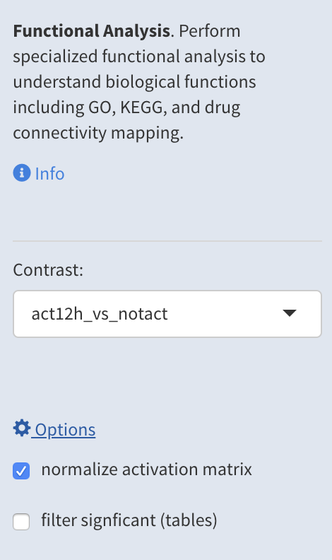
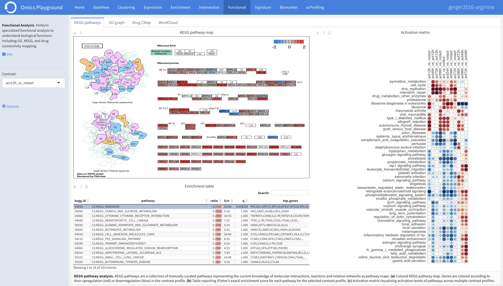
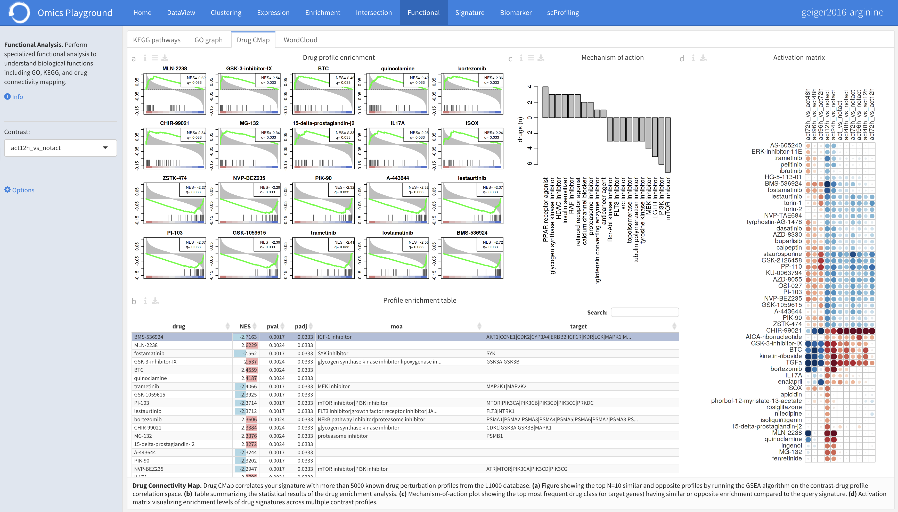
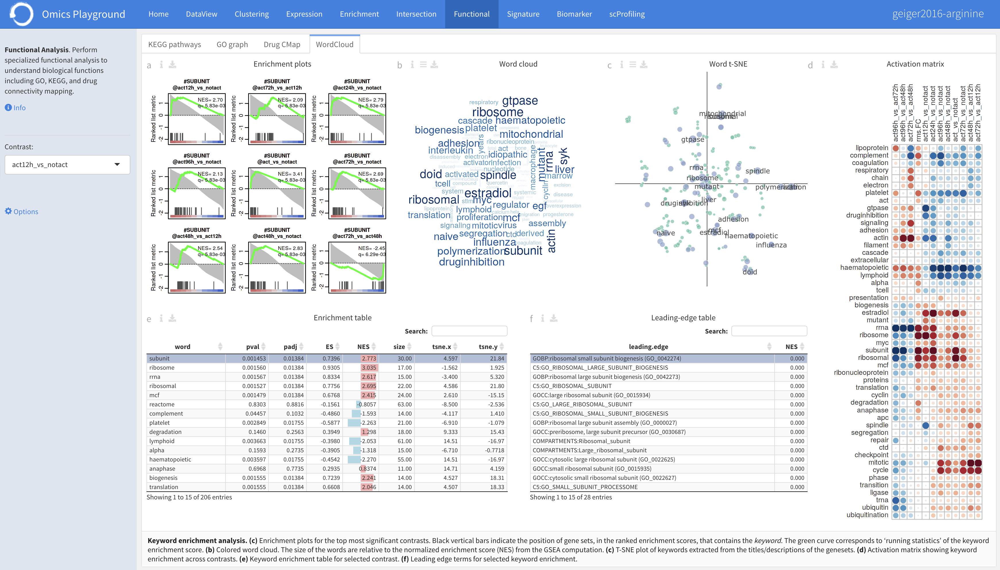
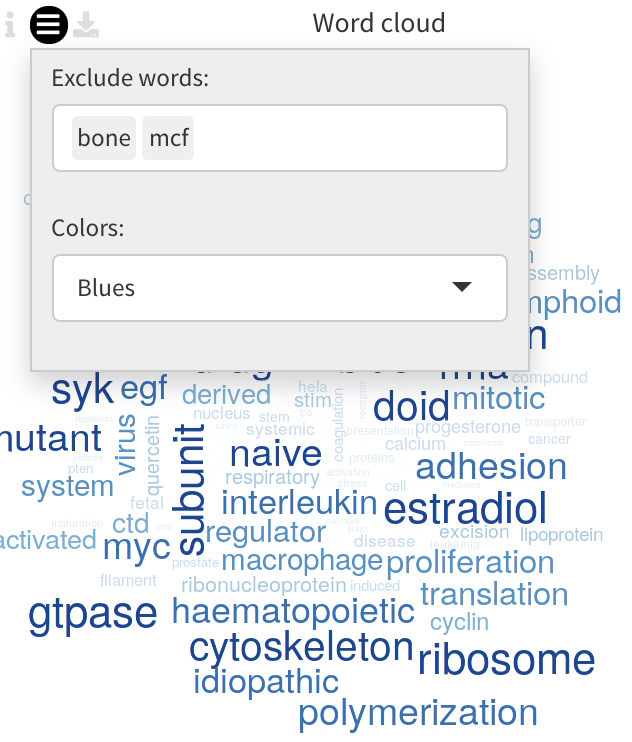
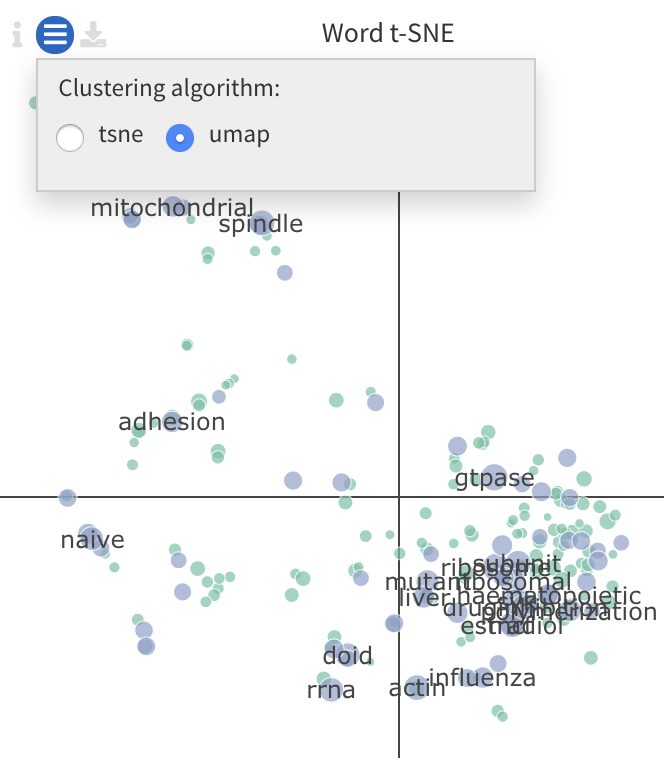

.. _Functional:

Functional Analysis
================================================================================
This module performs specialized pathway and enrichment analysis
providing higher level functional and visual analysis

The **KEGG pathways** panel maps the differential fold-changes onto
the `KEGG <https://www.ncbi.nlm.nih.gov/pmc/articles/PMC102409/>`__
pathway maps. Under the **GO** panel, a graph-based enrichment
analysis is done using the Gene Ontology (`GO
<http://geneontology.org/>`__) graph structure. The **Drug Connectivity
Map** panel, for a given contrast, searches for the closest drug
profiles from the `L1000
<https://www.ncbi.nlm.nih.gov/pubmed/29195078>`__ drug expression
database. Finally, a **Word cloud** panel provide keyword enrichment
analysis on keywords in the geneset titles.

Input panel
--------------------------------------------------------------------------------
It is possible to more information about the module in the ``Info``
from the input panel. Users can specify the contrast of their interest
in the ``Contrast`` settings. Under the main *Options*, users can
select ``normalize activation matrix`` to fine-tune the coloring of an
activation matrices and ``filter significant (tables)`` to filter the
significant entries in the tables.

KEGG pathways
--------------------------------------------------------------------------------
`KEGG <https://www.ncbi.nlm.nih.gov/pmc/articles/PMC102409/>`__ is a collection
of manually curated pathways representing the current knowledge of molecular 
interactions, reactions and relation networks as pathway maps. In the 
**KEGG pathway** panel, each pathway is scored for the selected contrast profile
and reported in the table. A unique feature of the platform is that it provides 
an activation-heatmap comparing the activation levels of pathways across multiple
contrast profiles. This facilitates to quickly see and detect the similarities 
between profiles in certain pathways. More detailed explaination of each output
is provided below.

:**a**: In the pathway map, genes are colored according to their upregulation 
        (red) or downregulation (blue) in the contrast profile. Each pathway 
        is scored for the selected contrast profile and reported in the table 
        below.

:**b**: Enrichment table. The table is interactive; enabling user to sort on 
        different variables and select a pathway by clicking on the row in the 
        table. The scoring is performed by considering the total number of genes
        in the pathway (:option:`n`), the number of genes in the pathway supported by the 
        contrast profile (:option:`k`), the ratio of :option:`k/n`, and the ratio of 
        :option:`|upregulated or downregulated genes|/k`. Additionally, the table 
        contains the list of the upregulated and downregulated genes for each
        pathway and a :option:`q` value from the Fisher's test for the overlap.

:**c**: The KEGG activation matrix visualizes the activation levels of pathways
        (or pathway keywords) across multiple contrast profiles. This facilitates
        to quickly see and detect the similarities of certain pathways between
        contrasts. The size of the circles correspond to their relative activation,
        and are colored according to their upregulation (red) or downregulation
        (blue) in the contrast profile.

GO graph
--------------------------------------------------------------------------------
In the **GO** panel, users can perform `GO <http://geneontology.org/>`__ analysis.
GO defines functional concepts/classes and their relationships as a hierarchical
graph. 
The GO database provides a computational representation of the current knowledge 
about roles of genes for many organisms in terms of molecular functions, cellular
components and biological processes. All the features described under the 
**KEGG pathway** panel, such as scoring the gene sets and drawing an 
activation-heatmap,
can be performed for the GO database under the GO graph tab. Instead of pathway
maps, an annotated graph structure provided by the GO database is potted for
every selected gene set. 
Each output chart/table of the panel is describer below in detail.

:**a**: The structure of GO can be described in terms of a graph, where each
        GO term is a node, and the relationships between the terms are edges 
        between the nodes. GO is loosely hierarchical, with 'child' terms being
        more specialized than their 'parent' terms. The graph is interactive. 
        You can move the graph and zoom in using the mouse.
        Under the graph *Settings*, users can select ``Prune tree`` to prune
        the tree only with significant branches and ``color custers`` to 
        highlight clusters with different colors

        .. figure:: figures/psc6.2.a.png
            :align: center
            :width: 35%

:**b**: GO score table. The scoring of a GO term is performed by considering
        the cumulative score of all terms from that term to the root node. 
        That means that GO terms that are supported by higher level terms
        levels are preferentially scored.

:**c**: The GO activation matrix visualizes the activation of GO terms
        across conditions. From this figure, you can easily detect GO terms
        that are consistently up/down across conditions. The size of the circles
        correspond to their relative activation, and are colored according to 
        their upregulation (red) or downregulation (blue) in the contrast
        profile.

.. figure:: figures/psc6.2.png
    :align: center
    :width: 100%

    
Drug C-Map
--------------------------------------------------------------------------------

.. note::

    This module is supported in the EXPERT MODE only.

In the **Drug Connectivity Map** panel, users can correlate their signature with
more than 5000 known drug profiles from the 
`L1000 <https://www.ncbi.nlm.nih.gov/pubmed/29195078>`__ database. 
An activation-heatmap compares drug activation profiles across multiple contrasts. 
This facilitates to quickly see and detect the similarities between contrasts
for certain drugs.

:**a**: The Drug Connectivity Map correlates your signature with more than 
        5000 known drug profiles from the L1000 database, and shows the top
        N=10 similar and opposite profiles by running the GSEA algorithm on 
        the contrast-drug profile correlation space. Under the plots *Settings*,
        users can select the type of drug enrichment analysis: ``mono`` or 
        ``combo`` (if available).

        .. figure:: figures/psc6.3.a.png
            :align: center
            :width: 35%

:**b**: Drug profile enrichment table. Enrichment is calculated by correlating
        your signature with more than 5000 known drug profiles from the L1000
        database. Because the L1000 has multiple perturbation experiment for a
        single drug, drugs are scored by running the GSEA algorithm on the 
        contrast-drug profile correlation space. In this way, we obtain a 
        single score for multiple profiles of a single drug.

:**c**: This plot visualizes the mechanism of action (MOA) across the enriched
        drug profiles. On the vertical axis, the number of drugs with the same
        MOA are plotted. You can switch to visualize between MOA or target gene.
        Under the plots *Settings*, users can select the plot type of MOA
        analysis: by class description (``drug class``) or by target gene 
        (``target gene``).

        .. figure:: figures/psc6.3.c.png
            :align: center
            :width: 35%

    

WordCloud
--------------------------------------------------------------------------------

.. note::

    This module is supported in the EXPERT MODE only.

The **WordCloud** panel performs "keyword enrichment analysis". It
computes enrichment of a selected keyword across all contrasts. Select
a keyword by clicking a word in the 'Enrichment table'. Keyword
enrichment is computed by running GSEA on the enrichment score profile
for all contrasts. We defined the test set as the collection of
genesets that contain the keyword in the title/description.
		      

	    
:**a**: The **Enrichment plots** visualize the enrichment of the
	selected keyword in the contrasts.  Black vertical bars
	indicate the position of gene sets that contains the *keyword*
	in the ranked list of enrichment scores. The curve in green
	corresponds to the 'running statistic' of the keyword
	enrichment score. The more the green ES curve is shifted to
	the upper left of the graph, the more the keyword is enriched
	in the first group. Conversely, a shift of the green ES curve
	to the lower right, corresponds to keyword enrichment in the
	second group.

:**b**: The **Word cloud plot** visualizes the frequency/enrichment of
	keywords for the data set. Select a keyword in the 'Enrichment
	table'. In the plot settings, users can exclude certain words
	from the figure, or choose the color palette. The sizes of the
	words are relative to the normalized enrichment score (NES)
	from the GSEA computation. Keyword enrichment is computed by
	running GSEA on the mean (squared) enrichment profile
	(averaged over all contrasts). For each keyword, we defined
	the 'keyword set' as the collection of genesets that contain
	that keyword in the title/description.

:**c**: The **Word t-SNE** plot visualizes the similarity of the
	keywords that were found in the title/description of gene
	sets. Keywords that are often found together in
	title/descriptions are placed close together in the t-SNE. For
	each keyword we computed enrichment using GSEA on the mean
	(absolute) enrichment profiles (averaged over all
	contrasts). Statistically significant gene sets (q<0.05) are
	colored in red. The sizes of the nodes are proportional to the
	normalized enrichment score (NES) of the keyword. In the plot
	settings, the user can choose between t-SNE and "Uniform
	Manifold Approximation and Projection" (UMAP).

		 
:**d**: The **Activation matrix** visualizes the activation of drug
	activation enrichment across the conditions. The size of the
	circles correspond to their relative activation, and are
	colored according to their upregulation (red) or
	downregulation (blue) in the contrast profile.

:**e**: The **Enrichment table** summarizes the results from the
	enrichment test for the tested keywords. The NES corresponds
	to the normalized enrichment score from the GSEA analysis.

:**f**: The **Leading-edge table** shows the geneset titles that have
	contributed to the enrichment of the selected keyword.
