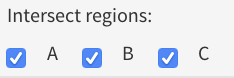

.. _Intersection:

Intersection Analysis
================================================================================
The **Intersection Analysis** module enables users to compare multiple
contrasts by intersecting the genes of profiles. The main goal is to
identify contrasts showing similar profiles.

For the selected contrasts, the platform provides volcano plots and
pairwise correlation plots between the profiles in the **Pairs**
panel. Simultaneously, a Venn diagram with the number of intersecting
genes between the profiles is plotted in **Venn diagram**
panel. Details of intersecting genes are also reported in an
interactive table. Users can check the pairwise correlations of the
contrasts under the **contrast heatmap** panel. Alternatively, the
**Connectivity Map (CMap)** shows the similarity of the contrasts
profiles as a t-SNE plot.

Input panel
--------------------------------------------------------------------------------
Users can select contrasts to compare from the ``Contrast`` settings
in the input panel on the left. Users can set the ``Filter`` for
filtering the features (i.e. genes). If ``<custom>`` is selected, an
input area will show where the user can paste a custom list of genes.

In EXPERT mode, users can also select the feature level for the
analysis from the ``Level``: gene or geneset level.

.. figure:: figures/psc7.0.png
    :align: center
    :width: 30%

Pairs
--------------------------------------------------------------------------------
For the selected contrasts, the **Pairs** panel provides pairwise
scatterplots for the differential expression profiles corresponding to
multiple contrasts. The main purpose of this panel is to identify
similarity or dissimilarity between selected contrasts. When K>=3
contrasts are selected, the figure shows a KxK scatterplot
matrix. 

.. figure:: figures/psc7.1.png
    :align: center
    :width: 100%

   
When K<=2, The **Pairs** panel provides an interactive pairwise
scatterplots for the differential expression profiles of the two
selected contrasts.  Since the plot is interactive, it is possible to
check the significance statistics of each gene in both contrasts with
a mouse hover-over. Users can also select points by dragging the
mouse.

.. figure:: figures/psc7.2.png
    :align: center
    :width: 100%
    

Contrast heatmap
--------------------------------------------------------------------------------
Users can check the similarity of multiple contrasts as a clustered
heatmap under the **Constrast heatmap** panel. Contrasts that are
similar will be clustered close together. The numeric value in the
cells correspond to the Pearson correlation coefficient between
contrast profiles. Red corresponds to positive correlation and blue to
negative correlation.  The Contrast heatmap facilitates to quickly
highlight the similarities and differences between multiple contrasts.

.. figure:: figures/psc7.3.png
    :align: center
    :width: 100%

Under the plot settings, users can specify to show the correlation
values in the cells in ``show correlation values``. Users can select
to show all contrasts or just the selected ones in the ``show all
contrasts``. They can also select the number of top genes to compute
correlation values from the ``number of top genes``.  

.. figure:: figures/psc7.3.0.png
    :align: center
    :width: 30%

Connectivity map
--------------------------------------------------------------------------------
The **Connectivity map** panel shows the similarity of the contrasts 
profiles as a t-SNE plot. Contrasts that are similar will be clustered close 
together, contrasts that are different are placed farther away. 
Under the plot settings, users can select multiple public datasets in the 
``Dataset`` to compare with external contrast profiles. There are some further 
settings, including ``Layout`` to set the plot layout, ``Top genes`` to specify
the number of top genes for computations, and ``Neighbours`` to set the number 
of neighbours two show in the t-SNE.

.. figure:: figures/psc7.4.0.png
    :align: center
    :width: 30%

The connectivity plot of two datasets is shown below, where the blue contrasts
belong to the current dataset while the red ones are from the public dataset in 
the platform. 

.. figure:: figures/psc7.4.png
    :align: center
    :width: 100%

Venn diagram
--------------------------------------------------------------------------------
The **Venn diagram** visualizes the number of intersecting genes
between the selected contrast profiles. The list of intersecting genes
with their fold-changes is also reported in an interactive table
below, where users can select and remove a particular contrasts from
the intersection analysis by selecting the desired overlap in
``Intersect regions``.

In the plot settings, users can specify the false discovery rate (FDR)
and the logarithmic fold-change (logFC) thresholds under ``FDR`` and
``logFC threshold``, respectively. In addition, they can specify the
counting mode for the intersection analysis: ``up/down`` for counting
the differentially expressed genes (overexpressed and underexpressed)
separately, or ``both`` for counting diffrentially expressed without
making any distinction.

.. figure:: figures/psc7.5.0.png
    :align: center
    :width: 30%
    
The resulting intersection Venn diagram with an interactive table is shown below.

.. figure:: figures/psc7.5.png
    :align: center
    :width: 100%    

	    
Meta-volcano
--------------------------------------------------------------------------------

.. note::

    This module is supported in the EXPERT MODE ONLY.

The **Meta-volcano** panel provides the volcano plot visualizing the
intersection between the profiles by highlighting the genes that are
common/shared in all selected comparisons.  Genes ranked by
cumulative fold-change across the selected comparisons.

In addition, it generates a sorted barplot of 
cumulative fold-change between the profiles.

.. figure:: figures/psc7.6.png
    :align: center
    :width: 100%    

