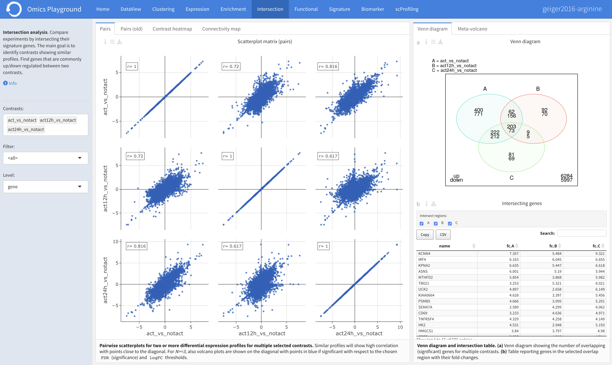
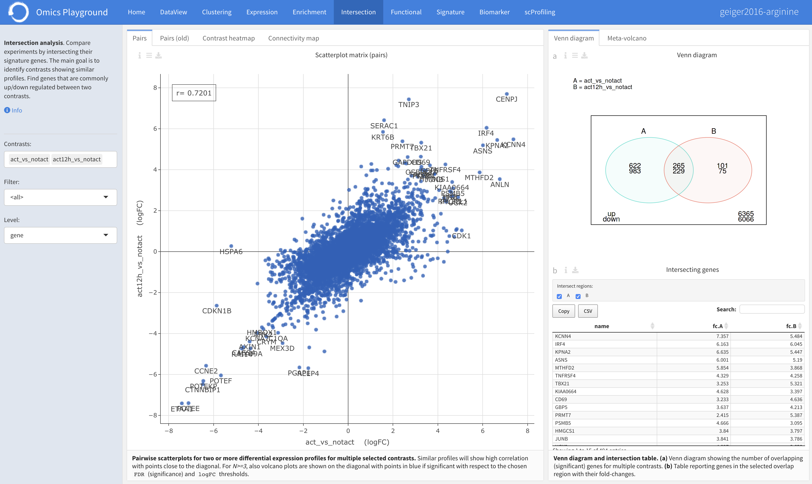
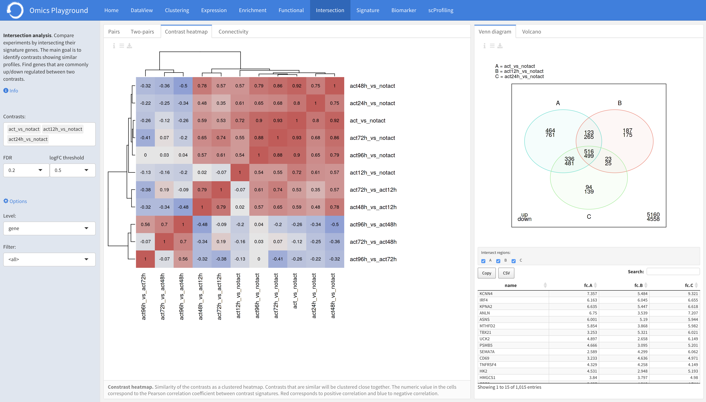
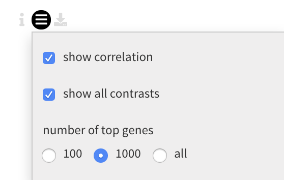
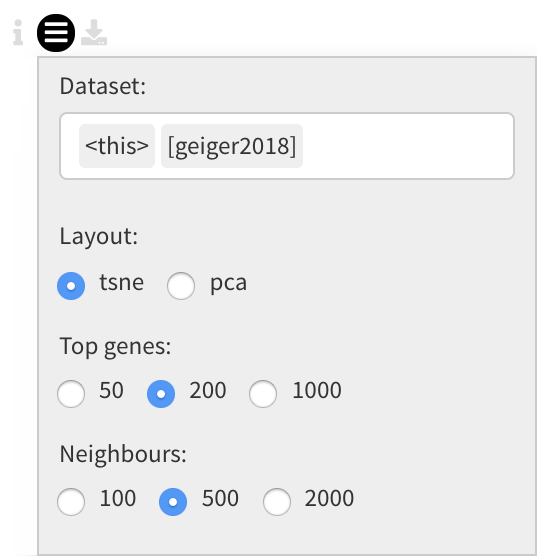
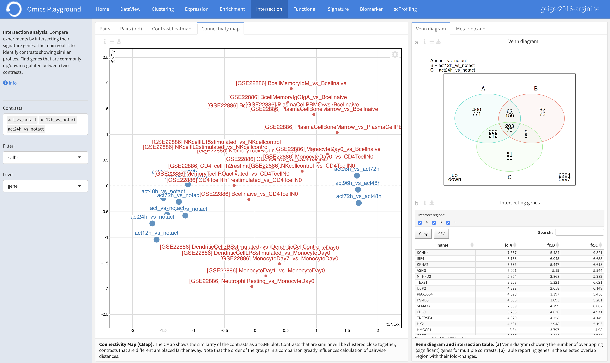
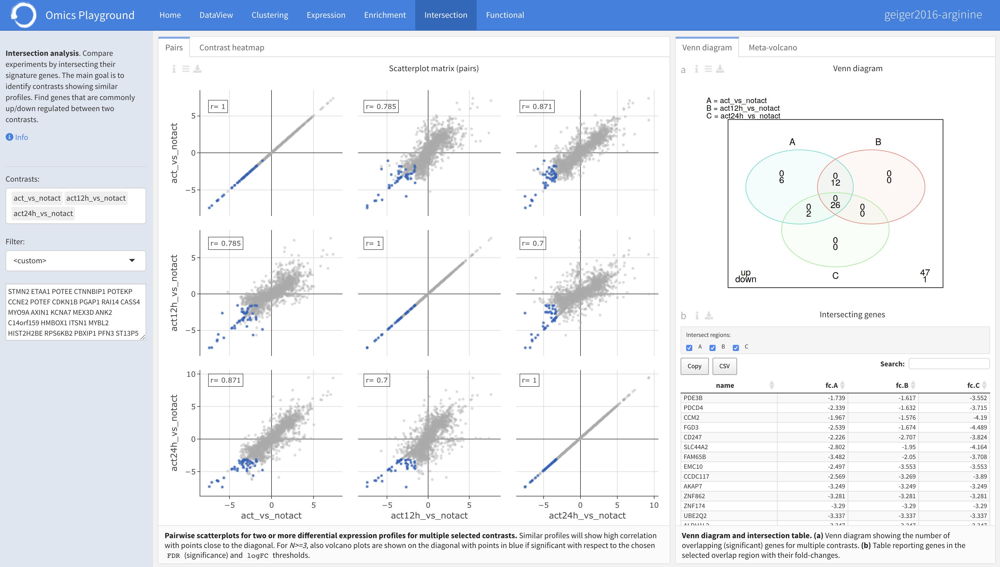
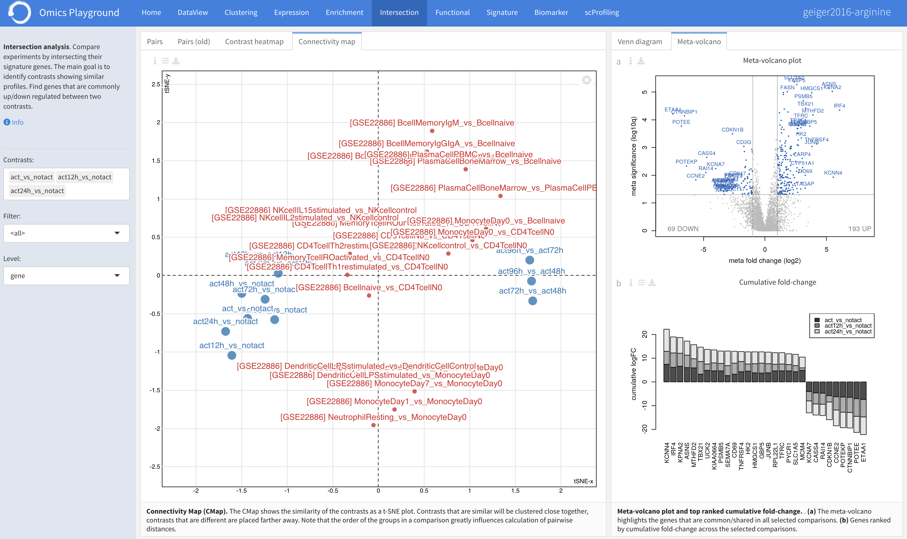

.. _Intersection:

Intersection Analysis
================================================================================
The **Intersection Analysis** module enables users to compare multiple contrasts
by intersecting the genes of profiles. The main goal is to identify contrasts
showing similar profiles.

For the selected contrasts, the platform provides volcano plots and pairwise
correlation plots between the profiles in the **Pairs** panel. Simultaneously,
a Venn diagram with the number of intersecting genes between the profiles is
plotted in **Venn diagram** panel. Details of intersecting genes is also reported
in an interactive table. A more detailed scatter plot of two profiles is possible
under the **Two-pairs** panel. Users can check the contrast heatmap of pairwise
correlations under the **Correlation** panel. Alternatively, the 
**Connectivity Map (CMap)** shows the similarity of the contrasts profiles 
as a t-SNE plot.

.. note::

    This module is supported in the EXPERT MODE ONLY.

Input slider
--------------------------------------------------------------------------------
Users can specify the contrasts of their interest to compare from the 
``Contrast`` settings in the input slider. Further settings including the false
discovery rate (FDR) and the logarithmic fold change (logFC) thresholds can be
tuned under the ``FDR`` and ``logFC threshold``, respectively.
Under the main *Options*, users can specify the level of analysis: gene or gene set
level from the ``Level`` and set the ``Filter`` for selecting feature filters.

.. figure:: figures/psc7.0.png
    :align: center
    :width: 30%

Pairs
--------------------------------------------------------------------------------
For selected contrasts, the **Pairs** pael provides volcano plots and pairwise
scatterplots for two or more differential expression profiles corresponding to
multiple contrasts. The main purpose of this panel is to identify 
similarity or dissimilarity between selected contrasts.

   
Two-pairs
--------------------------------------------------------------------------------
The **Two-pairs** plot panel provides an interactive pairwise scatterplots for 
two differential expression profiles corresponding to two contrasts. 
Since the plot is interactive, it is possible to check the significance statistics
of each gene in both contrasts with a mouse hover-over.

    

Contrast heatmap
--------------------------------------------------------------------------------
Users can check the similarity of multiple contrasts as a clustered heatmap under 
the **Constrast heatmap** panel. Contrasts that are similar will be clustered 
close together. The numeric value in the cells correspond to the Pearson 
correlation coefficient between contrast profiles. Red corresponds to positive 
correlation and blue to negative correlation.
The Contrast heatmap facilitates to quickly 
highlight the similarities and differences between multiple contrasts.

Under the plot *Settings*, users can specify to show all contrasts or just the 
selected ones in the ``show all contrasts``. They can also select the number
of top genes to compute correlation values from the ``number of top genes``.
It is also possible to fix heatmap layout when changing number of top genes
in the ``fix heatmap``.

Connectivity
--------------------------------------------------------------------------------
The **Connectivity** panel shows the similarity of the contrasts 
profiles as a t-SNE plot. Contrasts that are similar will be clustered close 
together, contrasts that are different are placed farther away. 
Under the plot *Settings*, users can select multiple public datasets in the 
``Dataset`` to compare with external contrast profiles. There are some further 
settings, including ``Layout`` to set the plot layout, ``Top genes`` to specify
the number of top genes for computations, and ``Neighbours`` to set the number 
of neighbours parameter in tSNE.

The connectivity plot of two datasets is shown below, where the blue contarsts
belong to the current dataset while the red ones are from the public dataset in 
the platform. 

Venn diagram
--------------------------------------------------------------------------------
The **Venn diagram** visualizes the number of intersecting genes between the
selected contrast profiles. The list of intersecting genes with further details
is also reported in an interactive table below, where users can select and remove
a particular contrasts from the intersection analysis. In addition, they can 
specify the counting mode for the intersection analysis under the plot 
*Settings*; ``up/down`` for counting the diffrentially expressed genes
(overexpressed and underexpressed) separately, or ``both`` for counting 
diffrentially expressed without making any distinction.

.. figure:: figures/psc7.5.0.png
    :align: center
    :width: 30%
    
The resulting intersection Venn diagram with an interactive table is shown below.

Volcano
--------------------------------------------------------------------------------
The **Volcano** panel provides the volcano plot visualizing the intersecting 
genes between the profiles. In addition, it genea=rates a sorted barplot of 
cumulative fold-change between the profiles.

