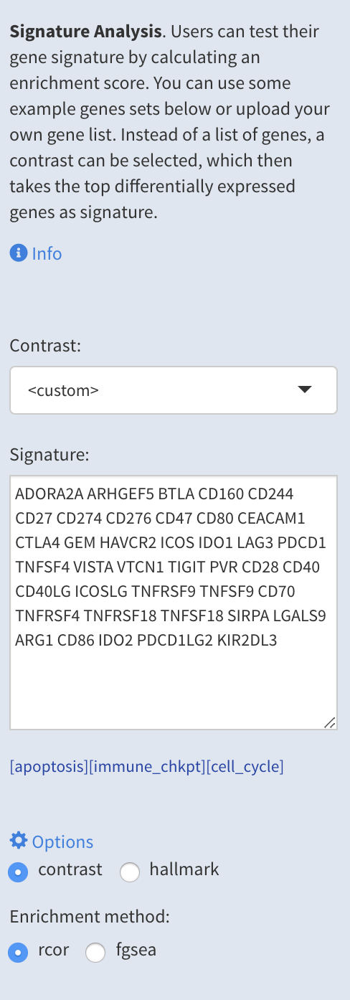
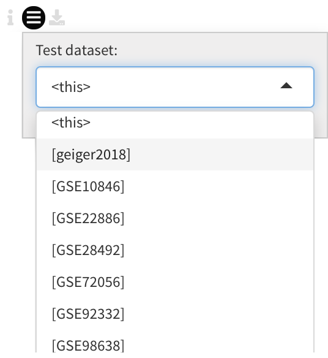
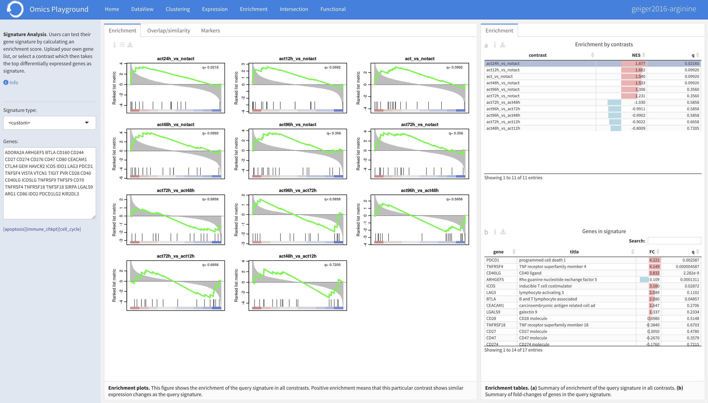
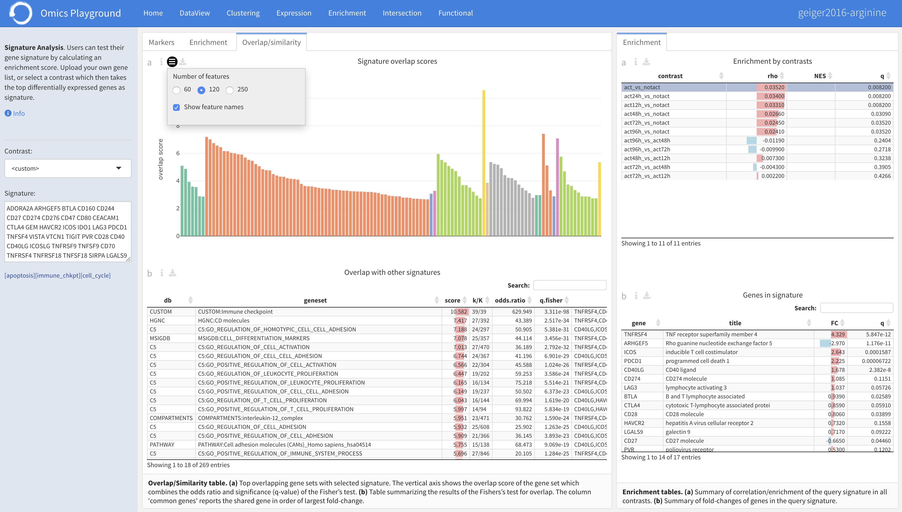
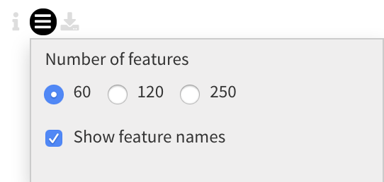
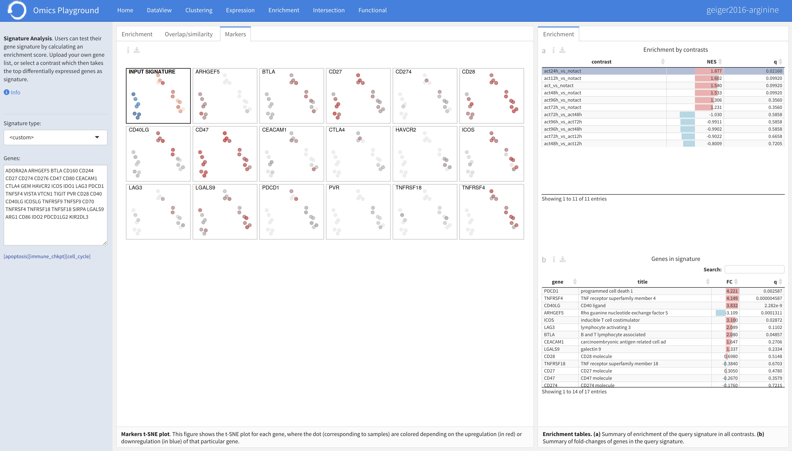

.. _Signature:

Signature Analysis
================================================================================

.. note::

    This module is supported in the EXPERT MODE only.

In the **Signature Analysis** module, users can test their custom gene
signature by uploading a custom list of genes. After uploading the
gene list, the **Enrichment** panel performs the enrichment analysis
of the gene list against all contrasts by running the GSEA algorithm
and plots enrichment outputs. Under the **Overlap/similarity** panel,
users can find the similarity of their gene list with other gene sets
and pathways. The **Markers** panel produces a t-SNE plot of samples
for the genes in the signature.
    

Input panel
--------------------------------------------------------------------------------
To start the analysis, specify the type of signature of their interest
in the ``Signature type`` settings. Users can choose between custom
signature, a contrast profile, or some predefined gene sets (Hallmark
and KEGG pathways). For a custom signature, users can upload their own
gene list or use one of the example gene lists provided. Instead, a
contrast profile can also be selected by selecting :option:`contrast`
as ``Signature type``, which then takes the top 100 most
differentially expressed genes as the signature. When
:option:`Hallmark` or :option:`KEGG` is selected, the user is
presented with a list of predefined gene sets to choose from.

Enrichment
--------------------------------------------------------------------------------
After uploading a gene list, the **Enrichment** panel performs the
enrichment analysis of the gene list against all contrasts by
computing a correlation based enrichment or running the `GSEA
<https://www.biorxiv.org/content/10.1101/060012v1.full>`__ algorithm
and plots enrichment outputs. Under the plot *Settings*, users can
quickly check the enrichment of their gene list in other contrasts
from the relevant public datasets by selecting the ``Query
dataset``.

The enrichment plots are shown below. They show the enrichment of the query 
signature across all constrasts. Positive enrichment means that this particular
contrast shows similar expression changes as the query signature.
Furthermore, the enrichment statistics can be found in the right tables:

:**Table a**: Enrichment scores across all contrasts for the selected
        query signature . The NES corresponds to the normalized
        enrichment score of the GSEA analysis.
:**Table b**: Genes in the query signature sorted by decreasing
        (absolute) fold-change corresponding to the contrast selected
        in Table (a).

Overlap/similarity
--------------------------------------------------------------------------------
Under the **Overlap/similarity** panel, users can compare their gene
list with all the gene sets and pathways in the platform through
overlap analysis, or also known as over-representation analysis. The
significance of overlap is computed by the Fisher's exact test. A
score is computed as the geometric mean of the absolute logarithm of
the odds ratio and q-value of the Fisher's test.

The table reports the :option:`score`, total number of genes in the
gene set (:option:`K`), the number of intersecting genes between the
list and the gene set (:option:`k`), the overlapping ratio of
:option:`k/K`, as well as the :option:`odds.ratio` and
:option:`q.fisher` values by the Fisher's test for the overlap test.

Under the plot settings, users can specify the number to top features
to show, or users can select to hide/show the feature names in the plot.
	    

	   

Markers
--------------------------------------------------------------------------------
The **Markers** panel produces a t-SNE plot of samples for each gene
in the signature, where the samples are colored with respect to the
upregulation (in red) or downregulation (in blue) of the gene. For
larger signatures, only the top most variable genes in the signature
are given. If you want to check a particular gene not shown, you must
reduce the number of genes in your list.

