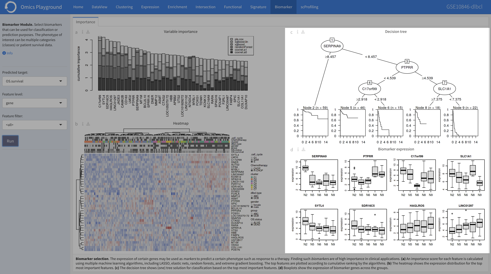

.. _Biomarker:

Biomarker Analysis
================================================================================

.. note::

    This module is supported in the EXPERT MODE only.
    
The **Biomarker** module performs the biomarker analysis that can be
used for classification or prediction purposes. Biomarker analysis
might also help to better understand which genes, mutations, or gene
sets influence the final phenotype the most.

Omics Playground calculates a variable importance score for each
feature using state-of-the-art machine learning algorithms, including
`LASSO <https://www.ncbi.nlm.nih.gov/pubmed/20808728>`__, `elastic
nets
<https://statweb.stanford.edu/~candes/papers/DantzigSelector.pdf>`__,
`random forests
<https://www.stat.berkeley.edu/~breiman/randomforest2001.pdf>`__, and
`extreme gradient boosting
<https://www.kdd.org/kdd2016/papers/files/rfp0697-chenAemb.pdf>`__,
and provides the top 50 features according to cumulative ranking by
the algorithms.  By combining several methods, the platform aims to
select the best possible biomarkers.

The phenotype of interest can be multi-categorical classes or
patient survival data. The platform also provides a heatmap of samples
based on identified top features. In addition, it generates a
classification (or survival) tree using top features and provides
expression boxplots by phenotype classes for features present in the
tree.
    
    
Input panel
--------------------------------------------------------------------------------

Users can select the target variable for biomarker selection in the
``Predicted target`` settings from the input panel and hit the ``Run``
button to start the biomarker computation. The target variable can be
multi-categorical classes or patient survival data. Furthermore, under
the main *Options*, they can set the feature level (gene or geneset)
in the ``Level`` setting. You can pre-filter features by selecting
filters in the ``Filter`` setting. If the user selects
:option:`<custom>`, an input area appears and one can paste a custom
gene list to be used as initial features.

.. figure:: figures/psc9.0.png
    :align: center
    :width: 30%

Importance
--------------------------------------------------------------------------------
	    
This panel provides the output of the biomarker analysis in multiple
figures. Below we provide an short explanation for each figure:

:**a**: **Variable importance plot.** A variable importance score for
        each feature is calculated using multiple machine learning
        algorithms, including `LASSO
        <https://www.ncbi.nlm.nih.gov/pubmed/20808728>`__, `elastic
        nets
        <https://statweb.stanford.edu/~candes/papers/DantzigSelector.pdf>`__,
        `random forests
        <https://www.stat.berkeley.edu/~breiman/randomforest2001.pdf>`__,
        and `extreme gradient boosting
        <https://www.kdd.org/kdd2016/papers/files/rfp0697-chenAemb.pdf>`__.
        By combining several methods, the platform aims to select the
        best possible biomarkers. The top features are plotted
        according to cumulative ranking by the algorithms.
        
:**b**: **Biomarker expression heatmap.** The heatmap shows the expression
        distribution for the top most important features.
                
:**c**: **Decision tree.** The decision tree shows one (out of many
        possible) tree solution for classification based on the top
        most important features.
        
:**d**: **Expression box plots.** These boxplots shows the expression
        of genes/samples of the identified features.

.. figure:: figures/psc9.1.png
    :align: center
    :width: 100%
    
If the data set under the study has a survival data and the survival
variable has been selected, the **biomarker** panel provides a
survival tree analysis using top features. Furthermore, it provides
expression boxplots by phenotype classes for features present in the
tree.

