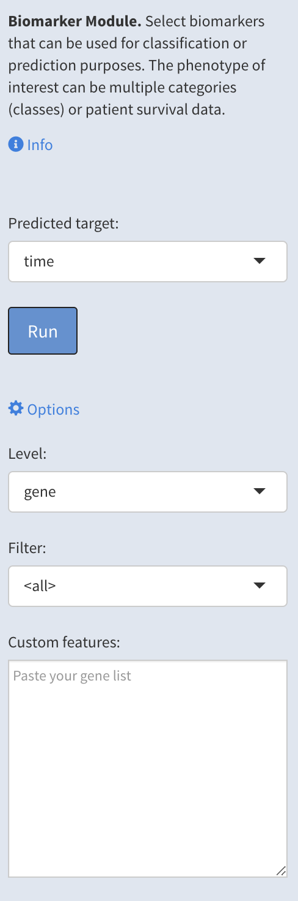
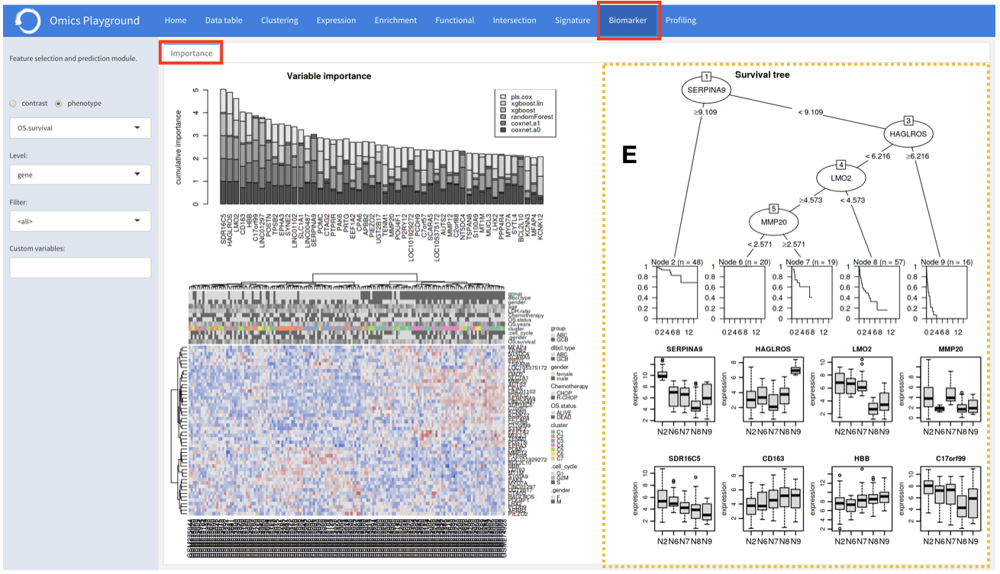

.. _Biomarker:

Biomarker Analysis
================================================================================
The **Biomarker** module performs the biomarker selection that can be used for 
classification or prediction purposes.

To better understand which genes, mutations, or gene sets influence the final 
phenotype the most, Playground calculates a variable importance score for each 
feature using state-of-the-art machine learning algorithms, including 
`LASSO <https://www.ncbi.nlm.nih.gov/pubmed/20808728>`__, 
`elastic nets <https://statweb.stanford.edu/~candes/papers/DantzigSelector.pdf>`__, 
`random forests <https://www.stat.berkeley.edu/~breiman/randomforest2001.pdf>`__, and
`extreme gradient boosting <https://www.kdd.org/kdd2016/papers/files/rfp0697-chenAemb.pdf>`__, 
and provides the top 50 features according to cumulative ranking by the algorithms.
By combining several methods, the platform aims to select the best possible biomarkers.

The phenotype of interest can be multiple categories (classes) or patient survival
data. Instead of choosing a phenotype, users can also specify a particular contrast
from the analysis and perform biomarker selection. The platform also provides a
heatmap of samples based on identified top features.

In addition, it generates a classification tree using top features and provides 
expression boxplots by phenotype classes for features present in the tree. 
The platform can also provide a survival tree analysis using top features and 
provides expression boxplots by phenotype classes for features present in the tree.

.. note::

    This module is supported in the EXPERT MODE ONLY.

Input slider
--------------------------------------------------------------------------------
Users can select the target variable for biomarker selection in the
``Predicted target`` settings from the input slider and hit the ``Run`` button
to start the biomarker computation. The target variable can be multiple 
categories (classes) or patient survival data.
Furthermore, under the main *Options*, 
they can set the feature level (gene or geneset) in the ``Level``, 
select a filter for the features in the ``Filter``, or
paste a custom gene list to be used as features in the
``Paste your gene list`` settings.

The panel provides the following output with an explanation for each figure.

:**a**: A variable importance score for each feature is calculated using multiple 
        machine learning algorithms, including 
        `LASSO <https://www.ncbi.nlm.nih.gov/pubmed/20808728>`__, 
        `elastic nets <https://statweb.stanford.edu/~candes/papers/DantzigSelector.pdf>`__, 
        `random forests <https://www.stat.berkeley.edu/~breiman/randomforest2001.pdf>`__, and
        `extreme gradient boosting <https://www.kdd.org/kdd2016/papers/files/rfp0697-chenAemb.pdf>`__.
        By combining several methods, the platform 
        aims to select the best possible biomarkers. The top features are plotted 
        according to cumulative ranking by the algorithms.
        
:**b**: The heatmap shows the expression distribution for the top most important 
        features. 
        
        
:**c**: The decision tree shows a tree solution for classification based on the top most important features.
        
:**d**: These boxplots shows the expression of genes/samples of the identified features.

.. figure:: figures/psc9.1.png
    :align: center
    :width: 100%
    
If the data set under the study has a survival data, the  **biomarker** panel can also 
provide a survival tree analysis using top features. Furthermore, it provides expression
boxplots by phenotype classes for features present in the tree.

