.. _scProfiling:

Single-Cell Profiling
================================================================================
The **Single-Cell Profiling** module is specifically developed for the analysis
and visualization of single-cell datasets. The main applications are 
identification of immuner cell types and visualisations of markers, copy number 
variations, phenotypes, and 
proportions across the cells.

The **Cell type** panel infers the type of cells using computational deconvolution
methods and reference datasets from the literature. 
The **Markers** panel provides potential marker genes, which are the top genes 
with the highest standard deviation within the expression data across the samples.
It is also possible to perform a copy number variation analysis under the **CNV**
panel. 
The **iTALK** consists of a computational approach from the literature
to characterize and illustrate intercellular communication signals in the 
multicellular tumor ecosystem.
Users can find figures visualizing the distribution of the phenotype information
under the **Phenotypes** panel.
The Proportions panel visualizes the interrelationships between two categorical 
variables (so-called cross tabulation).
Finally, for each combination of gene pairs, the platform can generate a 
cytometry-like plot of samples under the **Cytoplot** panel.

.. note::

    This module is supported in the EXPERT MODE ONLY.

Input slider
--------------------------------------------------------------------------------
Users can filter relevant samples in the ``Filter samples`` settings under the 
the main ``Options``. They can also specify to use a ``tsne`` or ``pca`` layout
for the figures, and group/ungroup the samples in the ``group`` settings.

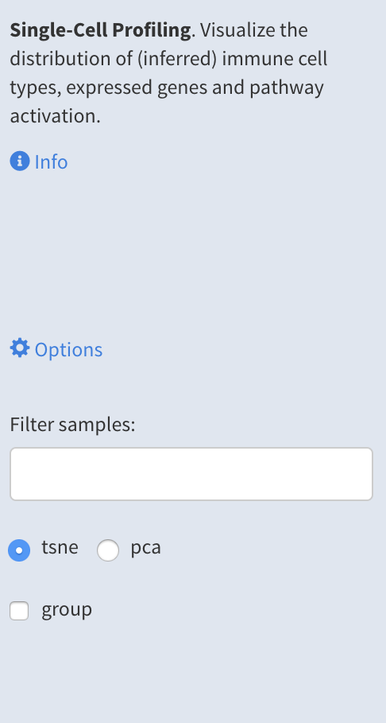

Cell type
--------------------------------------------------------------------------------
The **Cell type** profiling infers the type of cells using computational 
deconvolution methods and reference datasets from the literature. 
Under the plot *Settings*, users can specify the ``plot type``: distribution, dotmap,
or heatmap. They can select the reference dataset and the method for 
the cell type prediction in the ``reference`` and ``method`` settings, respectively.
Currently, we have implemented a total of 8 methods and 9 reference datasets 
to predict immune cell types (4 datasets), tissue types (2 datasets), 
cell lines (2 datasets) and cancer types (1 dataset). However, we plan to expand 
the collection of methods and databases and to infer other cell types.

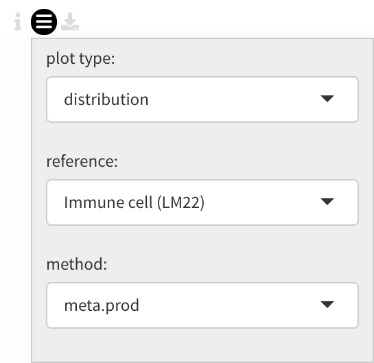

Based on their configuration settings, user will get a similar cell type prediction
plot below.

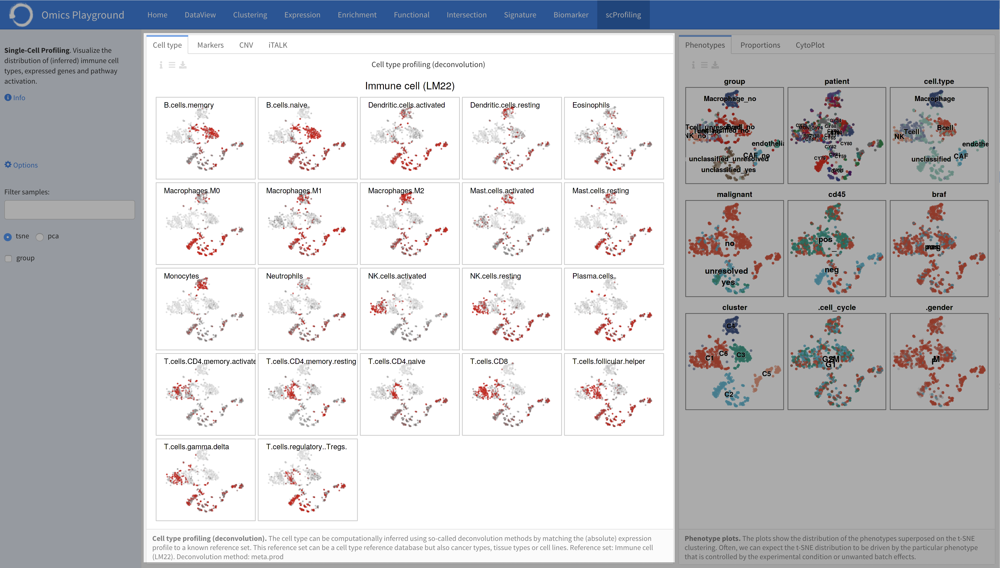

Markers
--------------------------------------------------------------------------------
The **Markers** panel produces for the top marker genes, a t-SNE with samples 
colored in red when the gene is overexpressed in corresponding samples. 
The top genes (N=36) with the highest standard deviation are plotted.

In the plot *Settings*, users can specify the ``Level`` of the marker analysis:
gene or gene set level. They can also restrict the analysis by 
selecting a particular functional group in the ``Feature set``, where genes are
divided into 89 groups, such as chemokines, transcription factors, genes involved
in immune checkpoint inhibition, and so on. In addition, it is possible to
filter markers by a specific keywords in the ``Filter`` setting.

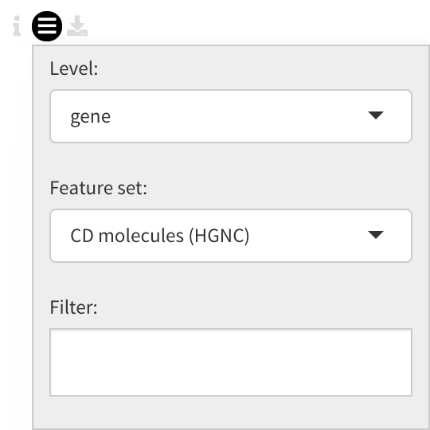

The resulting top marker genes are displayed below.
    
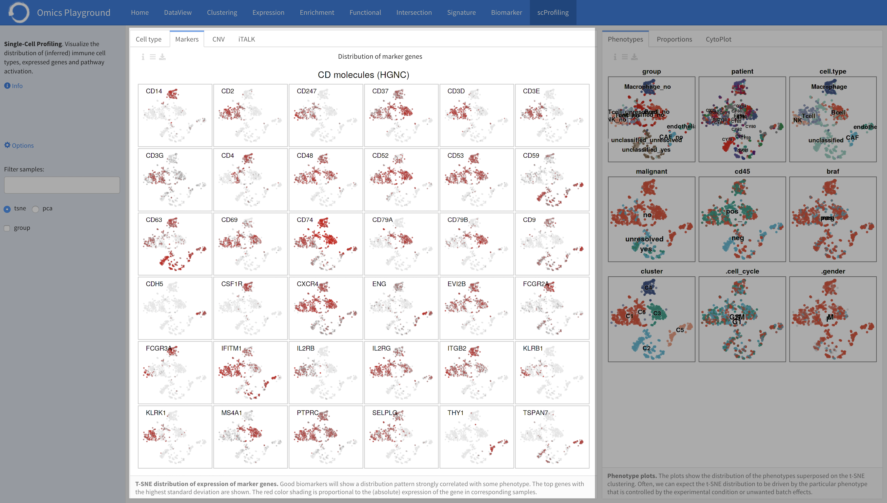

CNV
--------------------------------------------------------------------------------
The **CNV*8 panel performs the copy number variation (CNV) analysis. 
The copy number is estimated from gene expression data by computing a moving
average of the relative expression along the chromosomes. CNV generates a 
heatmap of samples versus chromosomes, where samples can be annotated 
further with a phenotype class provided in the data.
In the plot *Settings*, users can set ``Annotate with`` to annotate samples
according to a predefined phenotype group. The ``Order samples by`` can sort 
the samples according to the hierarchical clustering (``clust``) or the first
pricipal component (``pc1``).

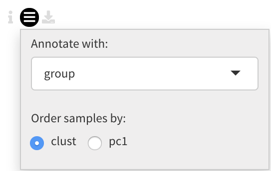

The output of the CNV panel is presented below.

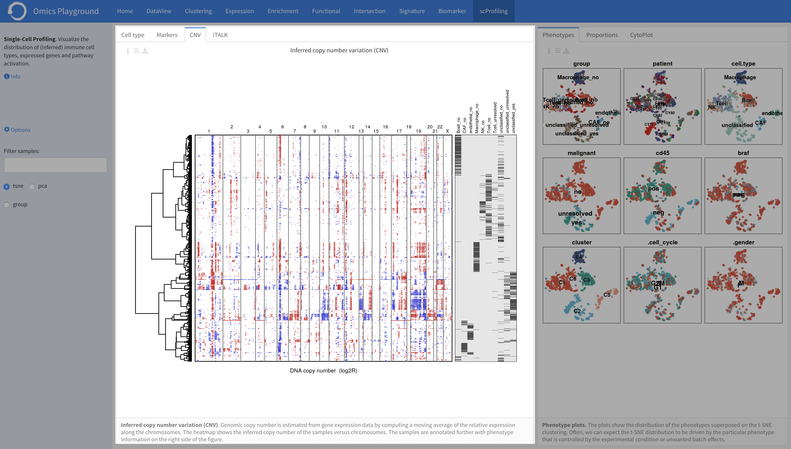

iTALK
--------------------------------------------------------------------------------
The **iTALK** panel implements the 
`iTALK <https://www.biorxiv.org/content/10.1101/507871v1>`__
package from the literature. It is designed to profile and visualize the 
ligand-receptor mediated intercellular cross-talk signals from single-cell 
RNA sequencing data (scRNA-seq). iTALK uses a manually curated list of 
ligand-receptor gene pairs further classified into 4 categories based on 
the primary function of the ligand: cytokines/chemokines, 
immune checkpoint genes, growth factors, and others.
Users can set the ``Group by`` to group the samples by predefined phenotype
groups and select one of the target gene categories under the ``Gene category``. 
The output of the panel is provided below with an explanation for each figure.

:**a**: The NetView plot visualizes the communication structure of ligand-receptor
        genes as a graph. The colors represent different types of cells as a 
        structure and the width of edges represent the strength of the communication.
        Labels on the edges show exactly how many interactions exist between two 
        types of cells. For further information, see 
        `iTALK <https://www.biorxiv.org/content/10.1101/507871v1>`__ R package.
        Users can set the number of top genes to be plotted in the figure in the
        ``top genes`` under the *Settings*.
        
        .. figure:: figures/psc10.4.a.png
            :align: center
            :width: 30%

:**b**: The Ligand-Receptor plot visualizes the communication structure of 
        ligand-receptor genes as a circle plot. The width of the arrow represents
        the expression level/log fold change of the ligand; while the width of
        arrow head represents the expression level/log fold change of the
        receptor. Different color and the type of the arrow stands for whether
        the ligand and/or receptor are upregulated or downregulated. 
        Under the *Settings*, it is possible to select the number of top pairs
        to be displayed in the ``ntop pairs``.

        .. figure:: figures/psc10.4.b.png
            :align: center
            :width: 30%
            
:**c**: The heatmap visualizes the expression level/log fold change of the 
        ligand/receptor genes. For further information, see 
        `iTALK <https://www.biorxiv.org/content/10.1101/507871v1>`__ R package.    

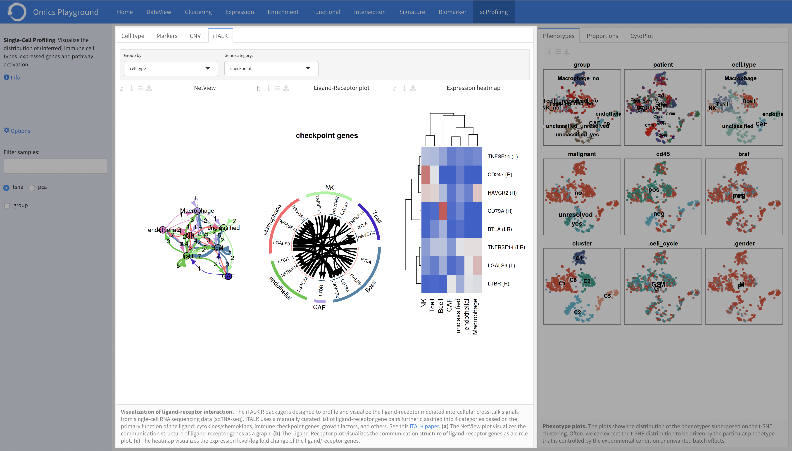

Phenotypes
--------------------------------------------------------------------------------
The **Phenotypes** panel demonstrates the distribution of the phenotypes 
superposed on the t-SNE clustering. Often, we can expect the t-SNE distribution
to be driven by the particular phenotype that is controlled by the experimental
condition or unwanted batch effects. Users can select whether they want the
group labels to be plotted inside the figures or in a seperate legend in the
``Legend`` under the *Settings*.

The phenotype figures superposed on the t-SNE clustering are shown below.

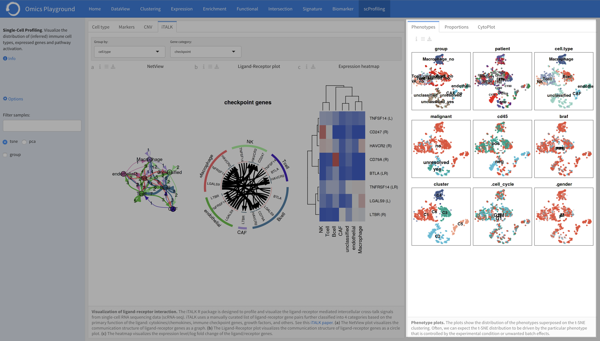

Proportions
--------------------------------------------------------------------------------
The **Proportions** panel visualizes the interrelationships between two categorical
variables (so-called cross tabulation). Although this feature is very suitable
for a single-cell sequencing data, it provides useful information about the
proportion of different cell types in samples obtained by the bulk sequencing method.
In the plot *Settings*, it is possible to choose the predefined phenotype 
groups on x and y axises in the ``x-axis`` and ``y-axis``, respectively.
For a selected phenotype group on the x-axis, average counts (abundance) 
barplot is provided at the top. In addition, users can visualize the 
expression barplot of a gene by specifying the ``gene``.

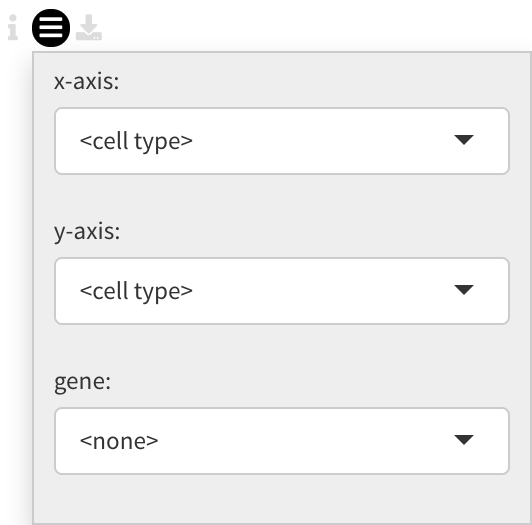

The following ptoportion plot is obtained as an output.

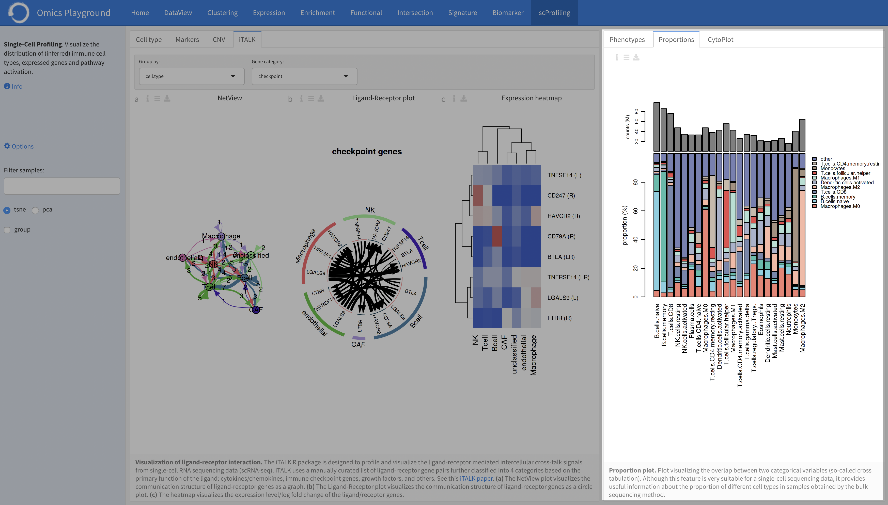

Cytoplot
--------------------------------------------------------------------------------
For each gene pairs combination, the platform can generate a cytometry-like plot 
of samples under the **Cytoplot** panel. The aim of this feature is to observe
the distribution of samples in relation to the selected gene pairs. For instance,
when applied to single-cell sequencing data from immunological cells, it can mimic
flow cytometry analysis and distinguish T helper cells from other T cells by 
selecting the CD4 and CD8 gene combination. Under the plot *Settings*, 
user can select their prefered genes on the x and y axises in the ``x-axis`` 
and ``y-axis``, respectively.

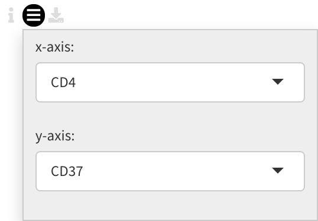

The cytometry-like plot for the selected genes are presented below.

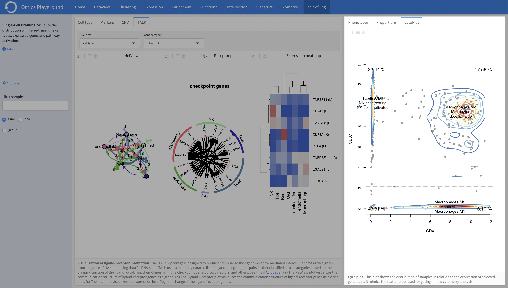

