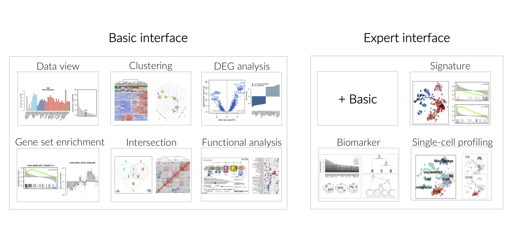
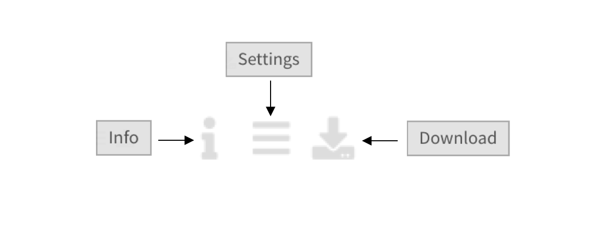

.. _Outline:

Outline
================================================================================

We subdivided the platform interface into Basic and Expert modes. 
Basic mode includes fundamental analysis modules such as :ref:`Home`, 
:ref:`DataView`, :ref:`Clustering`, :ref:`DEGs`, and :ref:`DESGs`, while Expert
mode includes additional modules such as :ref:`Functional`, :ref:`Intersection`,
:ref:`Signature`, :ref:`Biomarker` and :ref:`scProfiling`. 
Users can choose the interface mode according to their level of expertise. 
The main purpose of having two different modes is to provide a customisable 
experience suited to each user’s background.

Each figure or table on the platform is assigned the following interactive buttons, where:

* Info: Provides detailed information about the figure or table.
* Settings: Users can specify additional settings if applicable.
* Download: Downloads the figure as PDF or the table in CSV format.

