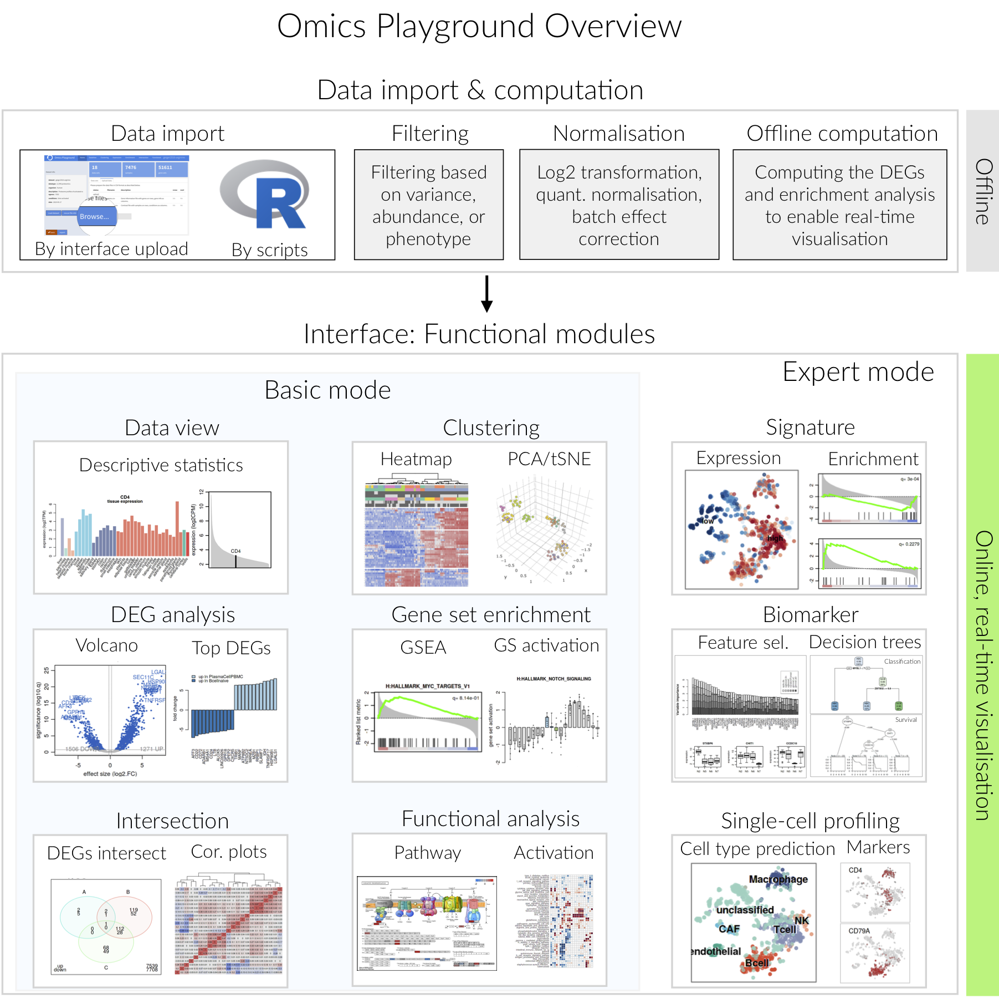

.. _Overview:

Overview
================================================================================
Omics Playground is a user-friendly and interactive web-based platform
for the analysis and visualization of transcriptomics and proteomics
data.  Currently the platform handles gene expression microarray,
RNA-seq and LC-MS/MS proteomics data, and supports two species, human
and mouse. Omics Playground has been in particular devised to also
support single cell RNA-seq data, as well as traditional gene
expression experiments.

The overview of the platform is shown in the figure below. It consists of
two main components. The first component addresses the data
importing and preprocessing, which includes preparing the input data, filtering,
normalising and precomputing of statistics for some analyses. The second part is
composed of the online interface, which supports the real-time visualisation and
interaction with users. The interface is subdivided into Basic and Expert modes
in order to provide a customisable experience suited to each user’s background.

