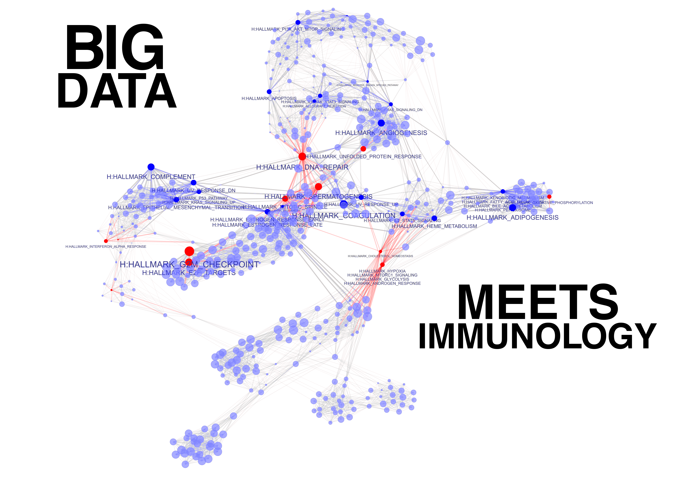

Home {data-orientation=rows}
===========================================================================================


Inputs {.sidebar data-width=320}
-------------------------------------------------------------------------------------------

```{r intro-title, results='asis', echo=FALSE}
##cat("<h3><b>The Immuno-Omics Playground</b></h3>")
cat("<br><br><br><br><br><br>")
```

```{r load-button, echo=FALSE, message=FALSE}
##-----------------------------------------------------------------------------
## PGX FILE INFO
##-----------------------------------------------------------------------------

## what files to use, heavy or light objects
INPUT_FILES = dir(PGX.DIR, pattern=".pgx$")
PGX.DEFAULT = INPUT_FILES[1]
##PGX.DEFAULT="irb2018-rorc-SC-8k.pgx"
INPUT_FILES = unique(c(PGX.DEFAULT,sort(INPUT_FILES)))  ## default on row1
##INPUT_FILES

PGXINFO=NULL
if(file.exists("pgx-datasets-info.csv")) {
    PGXINFO = read.csv("pgx-datasets-info.csv")
    PGXINFO = PGXINFO[match(INPUT_FILES,PGXINFO$dataset),]
    PGXINFO$dataset <- INPUT_FILES
    PGXINFO$description = shortstring(PGXINFO$description,800)
    PGXINFO$dataset = sub(".pgx","",PGXINFO$dataset)
    PGXINFO$conditions = gsub("[,]"," ",PGXINFO$conditions)
    colnames(PGXINFO)[1] = "nr"
}

## select data set
selectInput("input_data","", choices=INPUT_FILES, selected=PGX.DEFAULT)
actionButton("loadbutton",label="Load dataset",
             style="color: white; background-color: #0067c4AA; border-radius: 3px;")

br();br();br();br();br();br();
br();br();br();br();br();br();
br();br();br();br();br();br();
##if(PRO.VERSION) checkboxGroupInput('data_filter','Exclude:', choices=c("sex","ig"),
##                                   selected=c("sex","ig"), inline=TRUE)
if(DEV.VERSION) actionButton("data_scanfiles",label="rescan file info",
                             style="background-color: #800; border-radius: 3px;")
```	


```{r echo=FALSE, message=FALSE}
inputData <- eventReactive( input$loadbutton, {
    ##
    ## This is the main loader function that loads the ngs object.
    ##
    ##
    ##shinyjs::show(id="splash-content")
    ##shinyjs::hide(id="table-content")
    if(is.null(input$input_data)) return(NULL)
    
    fn = "rieckmann2017-immprot-4k.pgx"
    fn = INPUT_FILES[13]
    fn = INPUT_FILES[1]
    fn = input$input_data  ## from data-module tab

    if(is.null(fn)) return(NULL)                          
    if(fn=="") return(NULL)
    cat("inputData:: loading",fn,"\n")
    withProgress(
        message='loading...', value=0.8,
        load(file.path(PGX.DIR,fn),verbose=0)
    )
    cat("inputData:: finished loading\n")

    ##----------------- update input
    ##if(PRO.VERSION) {
    INPUT_FILES1 = dir(PGX.DIR, pattern=".pgx$")
    updateSelectInput(session,"input_data", choices=INPUT_FILES1, selected=fn)  ## update?
    ngs <- pgx.initialize(ngs) 
    ##shinyjs::hide(id="splash-content")
    ##shinyjs::show(id="table-content")    
    cat("inputData:: done!\n")
    return(ngs)
}, ignoreNULL=FALSE )

observeEvent( input$data_scanfiles, {
    cat("module-data:: observeEvent (loadButton)\n")
    cat("scanning PGX file info...\n")
    withProgress(message=">>> scanning available data sets...", value=0, {
        PGXINFO <- pgx.scanInfo(pgx.dir=PGX.DIR, inc.progress=TRUE)
    })
    cat("dim.PGXINFO=",dim(PGXINFO),"\n")
    INFO.FILE <- "pgx-datasets-info.csv"
    ##Sys.chmod("../shiny-dev", mode="0777")
    Sys.chmod(INFO.FILE, mode="0666")
    write.csv(PGXINFO, file=INFO.FILE)
})
```


Row 
-----------------------------------------------------------------------

### {.value-box}

```{r}
library(flexdashboard)
valueBox( value=nrow(PGXINFO), caption="data sets")
```

### {.value-box}

```{r}
valueBox( value=sum(PGXINFO$nsamples,na.rm=TRUE), caption="samples")
```

### {.value-box}

```{r}
valueBox( value=nrow(GSETxGENE), caption="gene sets")
```


Row {.tabset data-height=800}
-----------------------------------------------------------------------

### Data sets

```{r}
useShinyjs(rmd=TRUE)  ## to use click()

fillCol(flex=c(1), uiOutput('splash') )

output$splash <- renderUI({
    div(id="splash-content", plotOutput('splashplot'))
    ##hidden(div(id="table-content", dataTableOutput('pgxfiles')))
    div(id="table-content", dataTableOutput('pgxfiles'))
})

output$splashplot <- renderPlot({
    plot(exp)
})

##split=" ";n=5
andothers <- function(s, split=" ", n=8) {
    s1 <- strsplit(s, split=split)[[1]]
    if(length(s1)<=n) return(s)
    n2 <- setdiff(length(s1),n)
    paste(paste(head(s1,n), collapse=" "),"(+",n2,"others)")
}

output$pgxfiles <- DT::renderDataTable({
    
    if(is.null(PGXINFO)) return(NULL)
    ## get current view of raw_counts
    pgx.file = sub("[.]pgx$","",input$input_data)
    sel = match( pgx.file, PGXINFO$dataset)
    ##kk = unique(c("nr","dataset","datatype","organism","description",colnames(PGXINFO)))
    kk = unique(c("nr","dataset","datatype","organism","description",colnames(PGXINFO)))
    kk = intersect(kk,colnames(PGXINFO))
    PGXINFO = PGXINFO[,kk]
    PGXINFO = PGXINFO[order(PGXINFO$dataset),] 
    PGXINFO$nr <- 1:nrow(PGXINFO)
    PGXINFO$conditions <- sapply(PGXINFO$conditions, andothers, split=" ", n=6)
    DT::datatable( PGXINFO,
                  class = 'compact cell-border stripe hover',
                  rownames=FALSE,
                  extensions = c('Scroller'),
                  ##selection = list(mode='single', target='row', selected=sel ),
                  selection = list(mode='none'),
                  options=list(
                      ##dom = 'Blfrtip', 
                      pageLength = 100, ##  lengthMenu = c(20, 30, 40, 60, 100, 250),
                      scrollX = FALSE, scrollY =580, ## scroller=TRUE,
                      deferRender=TRUE
                  )  ## end of options.list 
                  )  %>%
        DT::formatStyle(0, target='row', fontSize='12px', lineHeight='95%')

})
```


### Splash

```{r intro-cover2, fig.align="center", echo=FALSE, out.width = '600px', out.height = '400px'}
##
knitr::include_graphics("resources/pgx-bigdata-biology-wt.png")
```


<!----

### Tutorial

```{r fig.align="center", echo=FALSE, out.width = '600px', out.height = '400px'}
##
```

### FAQ

```{r fig.align="center", echo=FALSE, out.width = '600px', out.height = '400px'}
##
```

--->


